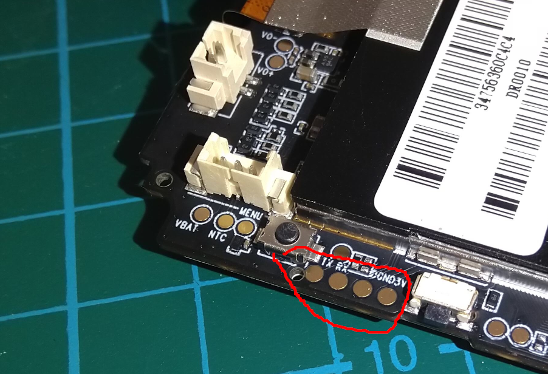

# 70mai Dash Cam Lite

This is an of the shelf Parking Camera that can be easily bought. It is branded by 70mai and usually is sold as "Dash Cam Lite",
see [the producer page](https://www.70mai.com/en/70mai-dash-cam-lite/).

The camera can be rack open to get access to 3.3V UART pins and a "boot from SD" push button next to it:

The battery can be disconnected and the board can be powered up from micro USB port. You can run your IPL/SPL/U-Boot/Linux by writing it to the SDCard and holding the "boot from SD" push button while powering the board up.

## SDCard content
The SDCard should contain a FAT16 partition (Id 6) with following files:
- ipl - first stage bootloader
- rtk - u-boot + kernel + initramfs

See the [breadbee_dev repo](https://github.com/breadbee/breadbee_dev/) and/or the [genimage from buildroot-mercury5](https://github.com/fifteenhex/buildroot_mercury5/blob/master/br2midrive08/board/70mai/midrive08/genimage.cfg) for more information.
