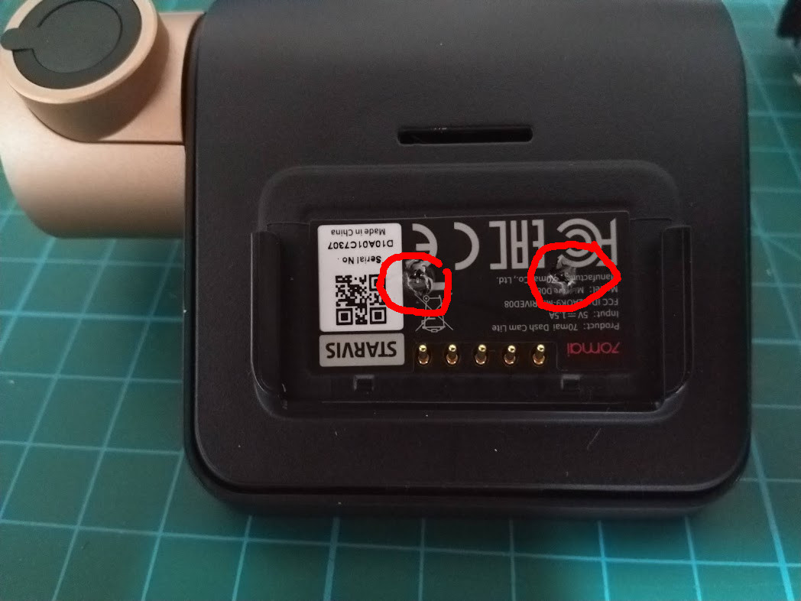
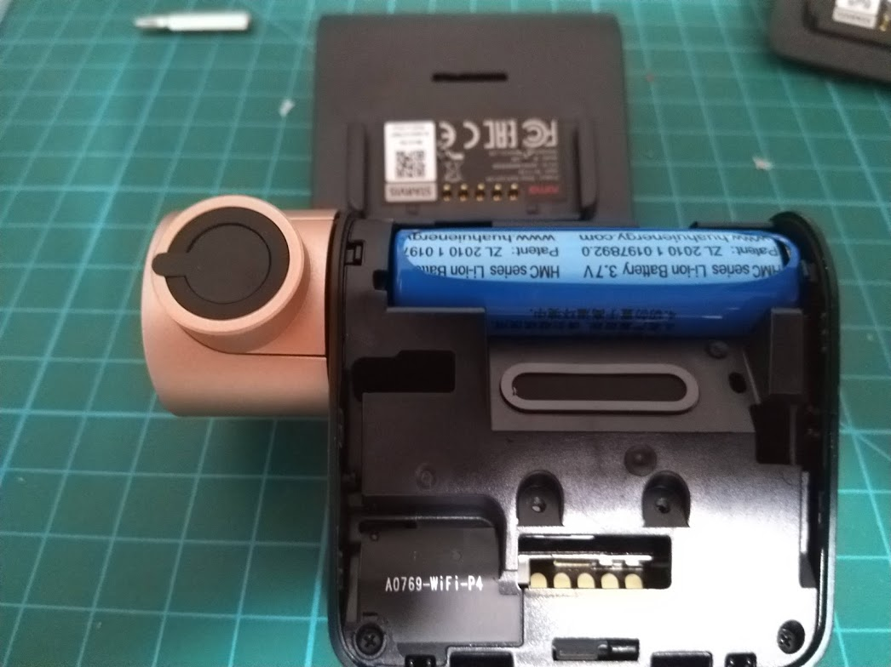
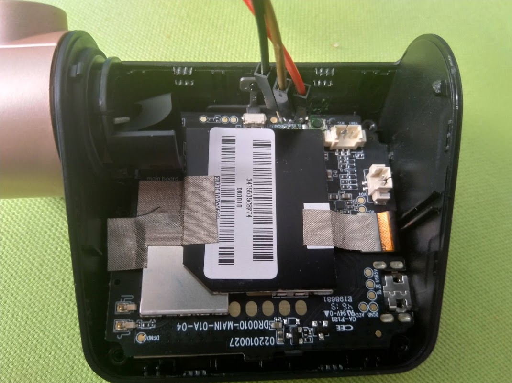

# 70mai Dash Cam Lite

This is an of the shelf Parking Camera that can be easily bought. It is branded by 70mai and usually is sold as "Dash Cam Lite",
see [the producer page](https://www.70mai.com/en/70mai-dash-cam-lite/).

The camera can be rack open to get access to 3.3V UART pins and a "boot from SD" push button next to it:

The battery can be disconnected and the board can be powered up from micro USB port. You can run your IPL/SPL/U-Boot/Linux by writing it to the SDCard and holding the "boot from SD" push button while powering the board up.

## Opening the device

The device can be opened without damaging it. All that is needed is a thin philips screwdriver (to get all the screws, the diameter of the head cannot exceed 3mm and must be at least 2cm long (i.e. the precision screwdriver sets with bits might be to think). First start by unscrewing two screws under the label on the back: 
The are no latches so you should be able to lift the cover with ease. Disconnect and remove the battery:  You will find 4 more screws to unscrew. Then, you can lift the middle cover, unconnecting the speaker and you have a nice access to the board.  At this point there are no more screws - you can gently pull the rotating camera tube to the side and lift the PCB and then the screen connected via flex cable but you can also operate the whole thing in the case as you have easy access to both UART test pins and bootstrap button. You can leave the battery, speaker, screen and camera unconnected if you prefer.

## Operating the board

There is no physical power/reset button on the board so in order to reset it, you have to plug/unplug the power. This is quite tedious since you also have to push the bootstrap button at the same time so a microusb cable with a physical on/off switch mith be usuful.

## SDCard content
The SDCard should contain a FAT16 partition (Id 6) with following files:
- ipl - first stage bootloader - can be vendor one or U-Boot SPL ([m5iplwork branch of this fork](https://github.com/breadbee/u-boot/tree/m5iplwork))
- rtk (in case of using the vendor IPL) - u-boot (possibly with kernel and initramfs if you want them to be loaded at one go)

See the [breadbee_dev repo](https://github.com/breadbee/breadbee_dev/) and/or the [genimage from buildroot-mercury5](https://github.com/fifteenhex/buildroot_mercury5/blob/master/br2midrive08/board/70mai/midrive08/genimage.cfg) for more information.
