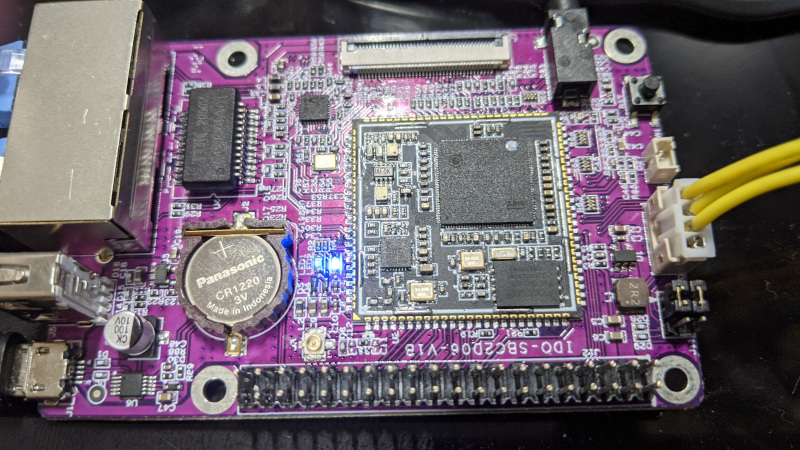

# IDO-SBC2D06

## Specs

## Hardware notes

- Second ethernet uses gpio0, gpio1, ttl16-23 (probably eth1 mode4 with ttl16 as a gpio for phy reset)
- The dip switches (J11) control whether pm uart is connected to the usb->serial or the debug header. For flashing via the debug header you need to put them to the left (close to the expansion header) and to use the serial port over usb you need to put them to the right (close to the debug connector).

## Pinouts

| #  | name                   | #  | name                   |
|----|------------------------|----|------------------------|
| 1  | sys_3v3                | 2  | vcc_5v                 |
| 3  | gpio3/i2c1_sda         | 4  | vcc_5v                 |
| 5  | gpio2/i2c1_scl         | 6  | gnd                    |
| 7  | gpio13                 | 8  | uart1_tx               |
| 9  | gnd                    | 10 | uart1_rx               |
| 11 | gpio12                 | 12 |                        |
| 13 | gpio47                 | 14 | gnd                    |
| 15 | sys_3v3                | 16 | dp_p1                  |
| 17 | gpio48                 | 18 | dm_p1                  |
| 19 | gpio11/spi0_do         | 20 | gnd                    |
| 21 | gpio10/spi0_di         | 22 |                        |
| 23 | gpio9/uart2_tx/spi0_ck | 24 | gpio8/uart2_rx/spi0_cz |
| 25 | gnd                    | 26 | gpio5/pwm1             |
| 27 | gpio7/i2c0_sda         | 28 | gpio6/i2c0_scl         |
| 29 | fuart_tx               | 30 | gnd                    |
| 31 | fuart_rx               | 32 | sar_gpio2              |
| 33 | fuart_cts              | 34 | gnd                    |
| 35 | fuart_rts              | 36 | dmic_r                 |
| 37 | pm_irin                | 38 | dmic_l                 |
| 39 | gnd                    | 40 | dmic_clk               |

## Misc

- [schematic](ido-sbc2d06-v1b-20210311(1).pdf)
