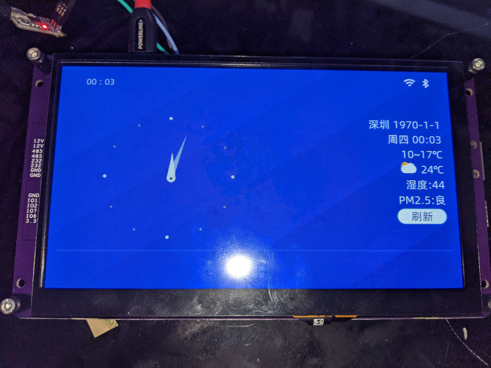
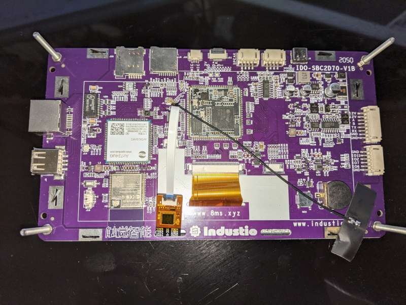

# IDO-SBC2D70





## Specs

- som2d01 SoM
- [Shenzhen ChenChen CC0702I50R 1024x600 panel](https://detail.1688.com/offer/610075231091.html?spm=a262i4.9164788.zhaohuo-list-offerlist.18.1031647dTg94vk)
- goodix gt911 ts controller

## Notes

- The shipped u-boot has the shell locked out. Reading the environment in, manually setting bootdelay to non-zero and writing it back did not work. Reading the environment, deleting bootcmd and writing that back works.

## Vendor FW bootlog

```
IPL g5da0ceb                                                                                                  
D-1e                                                                                                          
HW Reset                                                                                                      
miupll_233MHz                                                                                                 
MIU0 zq=0x003b                                                                                                
miu_bw_set                                                                                                    
utmi_1_init done                                                                                              
utmi_2_init done                                                                                              
utmi_3_init done                                                                                              
usbpll init done......                                                                                        
cpupll init done                                                                                              
SPI 54M                                                                                                       
clk_init done                                                                                                 
P1 USB_rterm trim=0x0000                                                                                      
P1 USB_HS_TX_CURRENT trim=0x0001                                                                              
P2 USB_rterm trim=0x0000                                                                                      
P2 USB_HS_TX_CURRENT trim=0x0001                                                                              
P3 USB_rterm trim=0x0000                                                                                      
P3 USB_HS_TX_CURRENT trim=0x0001                                                                              
PM_vol_bgap trim=0x0002                                                                                       
GCR_SAR_DATA trim=0x0192                                                                                      
ETH 10T output swing trim=0x0000                                                                              
ETH 100T output swing trim=0x0000                                                                             
ETH RX input impedance trim=0x0000                                                                            
ETH TX output impedance trim=0x0001                                                                           
MIPI_HS_RTERM trim=0x0001                                                                                     
MIPI_LP_RTERM trim=0x0000                                                                                     
128MB                                                                                                         
BIST0_0001-OK                                                                                                 
Enable MMU and CACHE                                                                                          
Load IPL_CUST from SPINAND                                                                                    
QUAD MODE ENABLE                                                                                              
Checksum OK                                                                                                   
                                                                                                              
IPL_CUST g5da0ceb                                                                                             
runUBOOT()                                                                                                    
runUBOOT()                                                                                                    
[SPINAND]                                                                                                     
SPI 54M                                                                                                       
Load UBOOT from SPINAND                                                                                       
 -Verify UBOOT CRC32 passed!                                                                                  
 -Decompress UBOOT XZ                                                                                         
  decomp_size=0x0009bbf4                                                                                      
Disable MMU and D-cache before jump to UBOOT                                                                  
                                                                                                              
                                                                                                              
U-Boot 2015.01 (Feb 02 2021 - 18:33:26)                                                                       
                                                                                                              
Version: I2g1ad5d0c                                                                                           
       Watchdog enabled                                                                                       
DRAM:                                                                                                         
WARNING: Caches not enabled                                                                                   
SPINAND: _MDrv_SPINAND_GET_INFO: Found SPINAND INFO                                                           
(0xCD) (0xEB) (0x11)                                                                                          
SPINAND: board_nand_init: CIS contains part info                                                              
256 MiB                                                                                                       
In:    serial                                                                                                 
Out:   serial                                                                                                 
Err:   serial                                                                                                 
gpio debug MHal_GPIO_Pad_Set: pin=4                                                                           
gpio[4] is 1                                                                                                  
gpio debug MHal_GPIO_Pad_Set: pin=18                                                                          
gpio[18] is 1                                                                                                 
                                                                                                              
NAND read: device 0 offset 0x4c0000, size 0x60000                                                             
Time:85802 us, speed:4582 KB/s                                                                                
 393216 bytes read: OK                                                                                        
gpio debug MHal_GPIO_Pad_Set: pin=71                                                                          
gpio[71] is 0                                                                                                 
UBI: parsing mtd_dev string 'mtd=10'                                                                          
UBI: attaching mtd1 to ubi0                                                                                   
UBI: scanning is finished                                                                                     
UBI: attached mtd1 (name "mtd=10", size 48 MiB) to ubi0                                                       
UBI: PEB size: 131072 bytes (128 KiB), LEB size: 126976 bytes                                                 
UBI: min./max. I/O unit sizes: 2048/2048, sub-page size 2048                                                  
UBI: VID header offset: 2048 (aligned 2048), data offset: 4096                                                
UBI: good PEBs: 384, bad PEBs: 0, corrupted PEBs: 0                                                           
UBI: user volume: 3, internal volumes: 1, max. volumes count: 128                                             
UBI: max/mean erase counter: 2/0, WL threshold: 4096, image sequence number: 2052046083                       
UBI: available PEBs: 0, total reserved PEBs: 384, PEBs reserved for bad PEB handling: 40                      
Read 0 bytes from volume kernel to 22000000                                                                   
No size specified -> Using max size (2031616)                                                                 
gpio debug MHal_GPIO_Pad_Set: pin=71                                                                          
gpio[71] is 1                                                                                                 
##  Booting kernel from Legacy Image at 22000000 ...                                                          
   Image Name:   MVX4##I2M#g1ad5d0cKL_LX409##[BR:                                                             
   Image Type:   ARM Linux Kernel Image (lzma compressed)                                                     
   Data Size:    1965708 Bytes = 1.9 MiB                                                                      
   Load Address: 20008000                                                                                     
   Entry Point:  20008000                                                                                     
   Verifying Checksum ... OK                                                                                  
-usb_stop(USB_PORT0)                                                                                          
-usb_stop(USB_PORT1)                                                                                          
-usb_stop(USB_PORT2)                                                                                          
   Uncompressing Kernel Image ...                                                                             
[XZ] !!!reserved 0x21000000 length=0x 1000000 for xz!!                                                        
   XZ: uncompressed size=0x3e4000, ret=7                                                                      
OK                                                                                                            
atags:0x20000000                                                                                              
                                                                                                              
Starting kernel ...                                                                                           
                                                                                                              
[    0.000000] Booting Linux on physical CPU 0x0                                                              
[    0.000000] Linux version 4.9.84 (sk@ubuntu) (gcc version 8.2.1 20180802 (GNU Toolchain for the A-profile 1
[    0.000000] CPU: ARMv7 Processor [410fc075] revision 5 (ARMv7), cr=50c5387d                                
[    0.000000] CPU: div instructions available: patching division code                                        
[    0.000000] CPU: PIPT / VIPT nonaliasing data cache, VIPT aliasing instruction cache                       
[    0.000000] early_atags_to_fdt() success                                                                   
[    0.000000] OF: fdt:Machine model: INFINITY2M SSC011A-S01A-S                                               
[    0.000000] LXmem is 0x7f00000 PHYS_OFFSET is 0x20000000                                                   
[    0.000000] Add mem start 0x20000000 size 0x7f00000!!!!                                                    
[    0.000000]                                                                                                
[    0.000000] LX_MEM  = 0x20000000, 0x7f00000                                                                
[    0.000000] LX_MEM2 = 0x0, 0x0                                                                             
[    0.000000] LX_MEM3 = 0x0, 0x0                                                                             
[    0.000000] EMAC_LEN= 0x0                                                                                  
[    0.000000] DRAM_LEN= 0x0                                                                                  
[    0.000000] deal_with_reserved_mmap memblock_reserve success mmap_reserved_config[0].reserved_start=       
[    0.000000] 0x27c00000                                                                                     
[    0.000000]                                                                                                
[    0.000000] deal_with_reserve_mma_heap memblock_reserve success mma_config[0].reserved_start=              
[    0.000000] 0x26700000                                                                                     
[    0.000000]                                                                                                
[    0.000000] cma: Reserved 2 MiB at 0x26400000                                                              
[    0.000000] Memory policy: Data cache writealloc                                                           
[    0.000000] percpu: Embedded 13 pages/cpu @c66bf000 s21016 r8192 d24040 u53248                             
[    0.000000] Built 1 zonelists in Zone order, mobility grouping on.  Total pages: 26882                     
[    0.000000] Kernel command line: wt_board=WT2022 console=ttyS0,115200 rootfstype=squashfs,ubifs rootwait=1)
[    0.000000] PID hash table entries: 512 (order: -1, 2048 bytes)                                            
[    0.000000] Dentry cache hash table entries: 16384 (order: 4, 65536 bytes)                                 
[    0.000000] Inode-cache hash table entries: 8192 (order: 3, 32768 bytes)                                   
[    0.000000] Memory: 98060K/108544K available (2433K kernel code, 200K rwdata, 1060K rodata, 160K init, 147)
[    0.000000] Virtual kernel memory layout:                                                                  
[    0.000000]     vector  : 0xffff0000 - 0xffff1000   (   4 kB)                                              
[    0.000000]     fixmap  : 0xffc00000 - 0xfff00000   (3072 kB)                                              
[    0.000000]     vmalloc : 0xc8000000 - 0xff800000   ( 888 MB)                                              
[    0.000000]     lowmem  : 0xc0000000 - 0xc7f00000   ( 127 MB)                                              
[    0.000000]     modules : 0xbf800000 - 0xc0000000   (   8 MB)                                              
[    0.000000]       .text : 0xc0008000 - 0xc02689e8   (2435 kB)                                              
[    0.000000]       .init : 0xc0390000 - 0xc03b8000   ( 160 kB)                                              
[    0.000000]       .data : 0xc03b8000 - 0xc03ea148   ( 201 kB)                                              
[    0.000000]        .bss : 0xc03ec000 - 0xc0410efc   ( 148 kB)                                              
[    0.000000] SLUB: HWalign=64, Order=0-3, MinObjects=0, CPUs=2, Nodes=1                                     
[    0.000000] Preemptible hierarchical RCU implementation.                                                   
[    0.000000]  Build-time adjustment of leaf fanout to 32.                                                   
[    0.000000]  RCU restricting CPUs from NR_CPUS=4 to nr_cpu_ids=2.                                          
[    0.000000] RCU: Adjusting geometry for rcu_fanout_leaf=32, nr_cpu_ids=2                                   
[    0.000000] NR_IRQS:16 nr_irqs:16 16                                                                       
[    0.000000] ms_init_main_intc: np->name=ms_main_intc, parent=gic                                           
[    0.000000] ms_init_pm_intc: np->name=ms_pm_intc, parent=ms_main_intc                                      
[    0.000000] ss_init_gpi_intc: np->name=ms_gpi_intc, parent=ms_main_intc                                    
[    0.000000] Find CLK_cpupll_clk, hook ms_cpuclk_ops                                                        
[    0.000000] arm_arch_timer: Architected cp15 timer(s) running at 6.00MHz (virt).                           
[    0.000000] clocksource: arch_sys_counter: mask: 0xffffffffffffff max_cycles: 0x1623fa770, max_idle_ns: 44s
[    0.000005] sched_clock: 56 bits at 6MHz, resolution 166ns, wraps every 4398046511055ns                    
[    0.000017] Switching to timer-based delay loop, resolution 166ns                                          
[    0.000347] Console: colour dummy device 80x30                                                             
[    0.353592] console [ttyS0] enabled                                                                        
[    0.357081] Calibrating delay loop (skipped), value calculated using timer frequency.. 12.00 BogoMIPS (lpj)
[    0.367344] pid_max: default: 4096 minimum: 301                                                            
[    0.371938] Mount-cache hash table entries: 1024 (order: 0, 4096 bytes)                                    
[    0.378498] Mountpoint-cache hash table entries: 1024 (order: 0, 4096 bytes)                               
[    0.386066] CPU: Testing write buffer coherency: ok                                                        
[    0.390991] CPU0: update cpu_capacity 1024                                                                 
[    0.394928] CPU0: thread -1, cpu 0, socket 0, mpidr 80000000                                               
[    0.400780] Setting up static identity map for 0x20008240 - 0x20008270                                     
[    0.610920] CPU1: update cpu_capacity 1024                                                                 
[    0.610926] CPU1: thread -1, cpu 1, socket 0, mpidr 80000001                                               
[    0.611033] Brought up 2 CPUs                                                                              
[    0.623598] SMP: Total of 2 processors activated (24.00 BogoMIPS).                                         
[    0.629764] CPU: All CPU(s) started in SVC mode.                                                           
[    0.634968] devtmpfs: initialized                                                                          
[    0.651689] VFP support v0.3: implementor 41 architecture 2 part 30 variant 7 rev 5                        
[    0.659490] clocksource: jiffies: mask: 0xffffffff max_cycles: 0xffffffff, max_idle_ns: 19112604462750000 s
[    0.669222] futex hash table entries: 16 (order: -2, 1024 bytes)                                           
[    0.675867] NET: Registered protocol family 16                                                             
[    0.680703] DMA: preallocated 256 KiB pool for atomic coherent allocations                                 
[    0.689243]                                                                                                
[    0.689243]                                                                                                
[    0.689243] Version : MVX4##I2M#g1ad5d0cKL_LX409##[BR:master]#XVM                                          
[    0.689243]                                                                                                
[    0.704951] GPIO: probe end[    0.707883] [ss_gpi_intc_domain_alloc] hw:42 -> v:44                         
[    0.716159] [Padmux]reset Pad_47(reg 0x101e03; mask0x70) to GPIO(org: UART0_MODE_1)                        
[    0.724026] hw-breakpoint: found 5 (+1 reserved) breakpoint and 4 watchpoint registers.                    
[    0.731878] hw-breakpoint: maximum watchpoint size is 8 bytes.                                             
[    0.748311] clocksource: Switched to clocksource arch_sys_counter                                          
[    0.765175] NET: Registered protocol family 2                                                              
[    0.769998] TCP established hash table entries: 1024 (order: 0, 4096 bytes)                                
[    0.776820] TCP bind hash table entries: 1024 (order: 2, 20480 bytes)                                      
[    0.783326] TCP: Hash tables configured (established 1024 bind 1024)                                       
[    0.789673] UDP hash table entries: 128 (order: 0, 6144 bytes)                                             
[    0.795442] UDP-Lite hash table entries: 128 (order: 0, 6144 bytes)                                        
[    0.801917] NET: Registered protocol family 1                                                              
[    0.806385] hw perfevents: enabled with armv7_cortex_a7 PMU driver, 5 counters available                   
[    0.816405] workingset: timestamp_bits=30 max_order=15 bucket_order=0                                      
[    0.831236] squashfs: version 4.0 (2009/01/31) Phillip Lougher                                             
[    0.839999] io scheduler noop registered                                                                   
[    0.843764] io scheduler deadline registered (default)                                                     
[    0.850536] i2c /dev entries driver                                                                        
[    0.854428] 1f221000.uart0: ttyS0 at MMIO 0x0 (irq = 30, base_baud = 10800000) is a unknown                
[    0.863019] 1f221200.uart1: ttyS1 at MMIO 0x0 (irq = 31, base_baud = 10800000) is a unknown                
[    0.871678] 1f220400.uart2: ttyS2 at MMIO 0x0 (irq = 32, base_baud = 10800000) is a unknown                
[    0.880280] 1f221400.uart2: ttyS3 at MMIO 0x0 (irq = 33, base_baud = 10800000) is a unknown                
[    0.889360] [Core Voltage] check_voltage_valid: Not support 0mV, use 900mV                                 
[    0.896491] ms_rtcpwc 1f006800.rtcpwc: rtc core: registered 1f006800.rtcpwc as rtc0                        
[    0.905562] [ms_cpufreq_init] Current clk=1005326304                                                       
[    0.911299] mstar_spinand_probe: mstar_spinand enableClock                                                 
[    0.916633] MSYS: DMEM request: [BDMA]:0x00000840                                                          
[    0.921441] MSYS: DMEM request: [BDMA]:0x00000840 success, CPU phy:@0x26442000, virt:@0xC6442000           
[    0.930473] MDrv_SPINAND_Init: Detected ID: MID =cd, DID =eb                                               
[    0.935973] _dumpNandInformation:warning, Bytes / Page :  2048                                             
[    0.941835] _dumpNandInformation:warning, Pages / Block:  64                                               
[    0.947461] _dumpNandInformation:warning, Sector/ Page :  512                                              
[    0.953216] _dumpNandInformation:warning, Spare / Page :  64                                               
[    0.958887] _dumpNandInformation:warning, Current config r:4 w:4 drv:1                                     
[    0.965610] mstar_spinand_probe: Magic memcmp pass                                                         
[    0.970249] mstar_spinand_probe: Get partition (Block 0 : page 1)                                          
[    0.976546] mstar_spinand_probe: CIS contains part info                                                    
[    0.981632] mstar_spinand_probe: Before nand_scan()...                                                     
[    0.986786] 13 cmdlinepart partitions found on MTD device nand0                                            
[    0.992675] mstar_spinand_probe: Mtd parts parse                                                           
[    0.997276] Creating 13 MTD partitions on "nand0":                                                         
[    1.002098] 0x000000140000-0x0000001a0000 : "IPL0"                                                         
[    1.009705] 0x0000001a0000-0x000000200000 : "IPL1"                                                         
[    1.017014] 0x000000200000-0x000000260000 : "IPL_CUST0"                                                    
[    1.024740] 0x000000260000-0x0000002c0000 : "IPL_CUST1"                                                    
[    1.032575] 0x0000002c0000-0x000000380000 : "UBOOT0"                                                       
[    1.040758] 0x000000380000-0x000000440000 : "UBOOT1"                                                       
[    1.048956] 0x000000440000-0x0000004a0000 : "ENV0"                                                         
[    1.056298] 0x0000004a0000-0x0000004c0000 : "KEY_CUST"                                                     
[    1.063617] 0x0000004c0000-0x000000520000 : "LOGO"                                                         
[    1.070799] 0x000000520000-0x000000580000 : "wtinfo"                                                       
[    1.085320] 0x000000580000-0x000003580000 : "ubi"                                                          
[    1.189752] 0x000003580000-0x000006580000 : "ubi2"                                                         
[    1.284978] 0x000006580000-0x000010000000 : "opt"                                                          
[    1.576463] NET: Registered protocol family 17                                                             
[    1.581380] ThumbEE CPU extension supported.                                                               
[    1.585498] Registering SWP/SWPB emulation handler                                                         
[    1.591389] UBI: auto-attach mtd10                                                                         
[    1.594637] ubi0: attaching mtd10                                                                          
[    1.851527] ubi0: scanning is finished                                                                     
[    1.861830] ubi0: attached mtd10 (name "ubi", size 48 MiB)                                                 
[    1.867163] ubi0: PEB size: 131072 bytes (128 KiB), LEB size: 126976 bytes                                 
[    1.874059] ubi0: min./max. I/O unit sizes: 2048/2048, sub-page size 2048                                  
[    1.880839] ubi0: VID header offset: 2048 (aligned 2048), data offset: 4096                                
[    1.887789] ubi0: good PEBs: 384, bad PEBs: 0, corrupted PEBs: 0                                           
[    1.893804] ubi0: user volume: 3, internal volumes: 1, max. volumes count: 128                             
[    1.901031] ubi0: max/mean erase counter: 2/0, WL threshold: 4096, image sequence number: 2052046083       
[    1.910166] ubi0: available PEBs: 0, total reserved PEBs: 384, PEBs reserved for bad PEB handling: 40      
[    1.919409] ubi0: background thread "ubi_bgt0d" started, PID 460                                           
[    1.926250] block ubiblock0_1: created from ubi0:1(rootfs)                                                 
[    1.931602] ubiblock: device ubiblock0_1 (rootfs) set to be root filesystem                                
[    1.974612] ms_rtcpwc 1f006800.rtcpwc: setting system clock to 1970-01-01 00:23:46 UTC (1426)              
[    1.983170] OF: fdt:not creating '/sys/firmware/fdt': CRC check failed                                     
[    1.993330] VFS: Mounted root (squashfs filesystem) readonly on device 254:0.                              
[    2.001953] devtmpfs: mounted                                                                              
[    2.004782] This architecture does not have kernel memory protection.                                      
[    2.324188] init: Console is alive                                                                         
[    2.327585] init: - watchdog -                                                                             
[    2.605678] kmodloader: loading kernel modules from /etc/modules-boot.d/*                                  
[    2.616086] kmodloader: done loading kernel modules from /etc/modules-boot.d/*                             
[    2.638522] init: - preinit -                                                                              
[    2.700143] mount_root: loading kmods from internal overlay                                                
[    2.716900] kmodloader: loading kernel modules from //etc/modules-boot.d/*                                 
[    2.723947] kmodloader: done loading kernel modules from //etc/modules-boot.d/*                            
[    2.847524] random: procd: uninitialized urandom read (4 bytes read)                                       
[    2.854379] UBIFS (ubi0:2): background thread "ubifs_bgt0_2" started, PID 484                              
[    2.883757] UBIFS (ubi0:2): recovery needed                                                                
[    2.943689] UBIFS (ubi0:2): recovery completed                                                             
[    2.948040] UBIFS (ubi0:2): UBIFS: mounted UBI device 0, volume 2, name "rootfs_data"                      
[    2.955832] UBIFS (ubi0:2): LEB size: 126976 bytes (124 KiB), min./max. I/O unit sizes: 2048 bytes/2048 bys
[    2.965786] UBIFS (ubi0:2): FS size: 25522176 bytes (24 MiB, 201 LEBs), journal size 1269760 bytes (1 MiB,)
[    2.976192] UBIFS (ubi0:2): reserved for root: 1205474 bytes (1177 KiB)                                    
[    2.982808] UBIFS (ubi0:2): media format: w4/r0 (latest is w4/r0), UUID 5067D53C-5791-41DB-993A-22C7B2C7F9l
[    2.995011] block: attempting to load /tmp/ubifs_cfg/upper/etc/config/fstab                                
[    3.005358] block: extroot: not configured                                                                 
[    3.058453] UBIFS (ubi0:2): un-mount UBI device 0                                                          
[    3.063017] UBIFS (ubi0:2): background thread "ubifs_bgt0_2" stops                                         
[    3.072604] UBIFS (ubi0:2): background thread "ubifs_bgt0_2" started, PID 487                              
[    3.147061] UBIFS (ubi0:2): UBIFS: mounted UBI device 0, volume 2, name "rootfs_data"                      
[    3.154771] UBIFS (ubi0:2): LEB size: 126976 bytes (124 KiB), min./max. I/O unit sizes: 2048 bytes/2048 bys
[    3.164681] UBIFS (ubi0:2): FS size: 25522176 bytes (24 MiB, 201 LEBs), journal size 1269760 bytes (1 MiB,)
[    3.175158] UBIFS (ubi0:2): reserved for root: 1205474 bytes (1177 KiB)                                    
[    3.181741] UBIFS (ubi0:2): media format: w4/r0 (latest is w4/r0), UUID 5067D53C-5791-41DB-993A-22C7B2C7F9l
[    3.301717] block: attempting to load /tmp/ubifs_cfg/upper/etc/config/fstab                                
[    3.311646] block: extroot: not configured                                                                 
[    3.350012] mount_root: switching to ubifs overlay                                                         
[    3.372419] procd: - early -                                                                               
[    3.375220] procd: - watchdog -                                                                            
[    4.068506] procd: - watchdog -                                                                            
[    4.071680] procd: - ubus -                                                                                
[    4.092461] random: ubusd: uninitialized urandom read (4 bytes read)                                       
[    4.136209] random: ubusd: uninitialized urandom read (4 bytes read)                                       
[    4.142687] random: ubusd: uninitialized urandom read (4 bytes read)                                       
[    4.148927] random: ubusd: uninitialized urandom read (4 bytes read)                                       
[    4.155356] random: ubusd: uninitialized urandom read (4 bytes read)                                       
[    4.161627] random: ubusd: uninitialized urandom read (4 bytes read)                                       
[    4.168036] random: ubusd: uninitialized urandom read (4 bytes read)                                       
[    4.174408] random: ubusd: uninitialized urandom read (4 bytes read)                                       
[    4.180918] procd: - init -                                                                                
Please press Enter to activate this console.                                                                  
[    4.324351] [ss_gpi_intc_domain_alloc] hw:58 -> v:56                                                       
[    4.326398] mhal: loading out-of-tree module taints kernel.                                                
[    4.326412] mhal: module license 'PROPRIETARY' taints kernel.                                              
[    4.326415] Disabling lock debugging due to kernel taint                                                   
[    4.332456] mhal driver init                                                                               
[    4.350406] jpe driver probed                                                                              
[    4.353845] DivpProcInit 515                                                                               
[    4.378477] module [sys] init                                                                              
[    4.381531] MI_SYSCFG_SetupMmapLoader default_config_path:/config/config_tool, argv1:/config/load_mmap,argi
[    4.402856] Function = init_glob_miu_kranges, Line = 604, Insert KProtect for LX @ MIU: 0                  
[    4.411700] Function = init_glob_miu_kranges, Line = 613, [INIT] for LX0 kprotect: from 0x20000000 to 0x270
[    4.424118] config...... strPath:/config/config_tool, argv0:/config/load_config                            
[    4.434060] function:parese_Cmdline,pCmd_Section:0x7f00000                                                 
[    4.439446] m[    4.440784] m                                                                              
a[    4.442437] _                                                                                             
h[    4.444090] e                                                                                             
a[    4.445744] p                                                                                             
_[    4.447398] n                                                                                             
a[    4.449052] m                                                                                             
e[    4.450705] 0                                                                                             
[    4.452275]     miu=0,sz=1500000  reserved_start=26700000                                                  
[    4.457732] r_front->miuBlockIndex:0,r_front->start_cpu_bus_pa:0x20000000,r_front->start_cpu_bus_pa+r_fron0
[    4.469114] r_back->miuBlockIndex:1,r_back->start_cpu_bus_pa:0x27c00000,r_back->start_cpu_bus_pa+r_back->l0
[    4.481584] Goodix-TS 1-005d: ID 911, version: 1060                                                        
[    4.481816] Goodix-TS 1-005d: Direct firmware load for goodix_911_cfg.bin failed with error -2             
[    4.499273] input: Goodix Capacitive TouchScreen as /devices/soc0/soc/1f223200.i2c1/i2c-1/1-005d/input/inp0
[    4.512194] mi_sys_mma_allocator_create success, heap_base_addr=26700000 length=1500000                    
[    4.520410] Kernel CONFIG_HZ = 100                                                                         
[    4.524457] Sigmastar Module version: project_commit.c8104f6 sdk_commit.677940d /home/xinhua.ye/alkaid_mp/.
[    4.546759] module [gfx] init                                                                              
[    4.559224] module [divp] init                                                                             
[    4.576889] module [vdec] init                                                                             
[    4.593568] module [ao] init                                                                               
[    4.606985] module [disp] init                                                                             
[    4.621755] module [ai] init                                                                               
[    4.638293] module [panel] init                                                                            
[    4.663384] [ss_gpi_intc_domain_alloc] hw:59 -> v:57                                                       
[    4.669778] reg=0x1F003410 clk=12000000, period=0x4af                                                      
[    4.674686] reg=0x1F003408 clk=12000000, u32Duty=0x0                                                       
[    4.680408] reg=0x1F003410 clk=12000000, period=0x4af                                                      
[    4.686108] reg=0x1F003408 clk=12000000, u32Duty=0x4af                                                     
[    4.697588] client [813] connected, module:sys                                                             
[    4.701213] kmodloader: loading kernel modules from /etc/modules.d/*                                       
[    4.711549] usbcore: registered new interface driver usbfs                                                 
[    4.711667] usbcore: registered new interface driver hub                                                   
[    4.711812] usbcore: registered new device driver usb                                                      
[    4.715667] zram: Added device: zram0                                                                      
[    4.740571] exFAT: Version 1.2.9                                                                           
[    4.753198] ehci_hcd: USB 2.0 'Enhanced' Host Controller (EHCI) Driver                                     
[    4.753201] ehci monitor start running                                                                     
[    4.753203] Mstar_ehc_init version:20180309                                                                
[    4.753318] Sstar-ehci-2 H.W init                                                                          
[    4.753337] Get power-enable-pad from DTS GPIO(47)                                                         
[    4.753365] [Enable_USB_VBUS] Enable USB VBUS GPIO(47)                                                     
[    4.753369] Titania3_series_start_ehc start                                                                
[    4.753373] [USB] config miu select [70] [e8] [ef] [ef]                                                    
[    4.753375] [USB] enable miu lower bound address subtraction                                               
[    4.753378] [USB] init squelch level 0x2                                                                   
[    4.754394] [USB] no platform_data, device tree coming                                                     
[    4.754405] [USB][EHC] dma coherent_mask 0xffffffffffffffff mask 0xffffffffffffffff                        
[    4.754441] BC disable                                                                                     
[    4.754449] [USB] soc:Sstar-ehci-2 irq --> 39                                                              
[    4.754461] Sstar-ehci-2 soc:Sstar-ehci-2: EHCI Host Controller                                            
[    4.754501] Sstar-ehci-2 soc:Sstar-ehci-2: new USB bus registered, assigned bus number 1                   
[    4.755631] Sstar-ehci-2 soc:Sstar-ehci-2: irq 39, io mem 0xfd285000                                       
[    4.790699] usb usb1: New USB device found, idVendor=1d6b, idProduct=0002                                  
[    4.790706] usb usb1: New USB device strings: Mfr=3, Product=2, SerialNumber=1                             
[    4.790712] usb usb1: Product: EHCI Host Controller                                                        
[    4.790717] usb usb1: Manufacturer: Linux 4.9.84 ehci_hcd                                                  
[    4.790722] usb usb1: SerialNumber: mstar                                                                  
[    4.795393] hub 1-0:1.0: USB hub found                                                                     
[    4.795490] hub 1-0:1.0: 1 port detected                                                                   
[    4.796006] Sstar-ehci-1 H.W init                                                                          
[    4.796021] Titania3_series_start_ehc start                                                                
[    4.796025] [USB] config miu select [70] [e8] [ef] [ef]                                                    
[    4.796027] [USB] enable miu lower bound address subtraction                                               
[    4.796030] [USB] init squelch level 0x2                                                                   
[    4.797040] [USB] no platform_data, device tree coming                                                     
[    4.797044] [USB][EHC] dma coherent_mask 0xffffffffffffffff mask 0xffffffffffffffff                        
[    4.797071] BC disable                                                                                     
[    4.797075] [USB] soc:Sstar-ehci-1 irq --> 38                                                              
[    4.797081] Sstar-ehci-1 soc:Sstar-ehci-1: EHCI Host Controller                                            
[    4.797105] Sstar-ehci-1 soc:Sstar-ehci-1: new USB bus registered, assigned bus number 2                   
[    4.842508] Sstar-ehci-1 soc:Sstar-ehci-1: irq 38, io mem 0xfd284800                                       
[    4.869745] usb usb2: New USB device found, idVendor=1d6b, idProduct=0002                                  
[    4.869752] usb usb2: New USB device strings: Mfr=3, Product=2, SerialNumber=1                             
[    4.869757] usb usb2: Product: EHCI Host Controller                                                        
[    4.869763] usb usb2: Manufacturer: Linux 4.9.84 ehci_hcd                                                  
[    4.869767] usb usb2: SerialNumber: mstar                                                                  
[    4.877068] hub 2-0:1.0: USB hub found                                                                     
[    4.877160] hub 2-0:1.0: 1 port detected                                                                   
[    4.879529] [GOP]HalGopUpdateGwinParam 720: GOP_id=011 not support                                         
[    4.879534] [GOP]HalGopSetArgb1555Alpha 1208: GOPId=0x11 not support                                       
[    4.879537] [GOP]HalGopSetArgb1555Alpha 1208: GOPId=0x11 not support                                       
[    4.882097]                                                                                                
[    4.882097] sstar_FB_SetBlending 402 u8GOP=1,u8win=0 aType=1 u8constAlpha=255                              
[    4.882648]                                                                                                
[    4.882649] SCSI subsystem initialized                                                                     
[    4.885363] libphy: Fixed MDIO Bus: probed                                                                 
[    4.902104] MSYS: DMEM request: [emac0_buff]:0x00000812                                                    
[    4.919379] MSYS: DMEM request: [emac0_buff]:0x00000812 success, CPU phy:@0x26449000, virt:@0xC6449000     
[    4.923202] libphy: mdio: probed                                                                           
[    4.923213] mdio_bus mdio-bus@emac0: /soc/emac0/mdio-bus@emac0/ethernet-phy@0 has invalid PHY address      
[    4.923222] mdio_bus mdio-bus@emac0: scan phy ethernet-phy at address 0                                    
[    4.947656] mdio_bus mdio-bus@emac0: scan phy ethernet-phy at address 1                                    
[    4.947676] mdio_bus mdio-bus@emac0: scan phy ethernet-phy at address 2                                    
[    4.947686] mdio_bus mdio-bus@emac0: scan phy ethernet-phy at address 3                                    
[    4.947696] mdio_bus mdio-bus@emac0: scan phy ethernet-phy at address 4                                    
[    4.947706] mdio_bus mdio-bus@emac0: scan phy ethernet-phy at address 5                                    
[    4.947716] mdio_bus mdio-bus@emac0: scan phy ethernet-phy at address 6                                    
[    4.947726] mdio_bus mdio-bus@emac0: scan phy ethernet-phy at address 7                                    
[    4.947736] mdio_bus mdio-bus@emac0: scan phy ethernet-phy at address 8                                    
[    4.947746] mdio_bus mdio-bus@emac0: scan phy ethernet-phy at address 9                                    
[    4.947756] mdio_bus mdio-bus@emac0: scan phy ethernet-phy at address 10                                   
[    4.947766] mdio_bus mdio-bus@emac0: scan phy ethernet-phy at address 11                                   
[    4.947775] mdio_bus mdio-bus@emac0: scan phy ethernet-phy at address 12                                   
[    4.947785] mdio_bus mdio-bus@emac0: scan phy ethernet-phy at address 13                                   
[    4.947795] mdio_bus mdio-bus@emac0: scan phy ethernet-phy at address 14                                   
[    4.947804] mdio_bus mdio-bus@emac0: scan phy ethernet-phy at address 15                                   
[    4.947814] mdio_bus mdio-bus@emac0: scan phy ethernet-phy at address 16                                   
[    4.947824] mdio_bus mdio-bus@emac0: scan phy ethernet-phy at address 17                                   
[    4.947834] mdio_bus mdio-bus@emac0: scan phy ethernet-phy at address 18                                   
[    4.947844] mdio_bus mdio-bus@emac0: scan phy ethernet-phy at address 19                                   
[    4.947853] mdio_bus mdio-bus@emac0: scan phy ethernet-phy at address 20                                   
[    4.947863] mdio_bus mdio-bus@emac0: scan phy ethernet-phy at address 21                                   
[    4.947873] mdio_bus mdio-bus@emac0: scan phy ethernet-phy at address 22                                   
[    4.947883] mdio_bus mdio-bus@emac0: scan phy ethernet-phy at address 23                                   
[    4.947892] mdio_bus mdio-bus@emac0: scan phy ethernet-phy at address 24                                   
[    4.947902] mdio_bus mdio-bus@emac0: scan phy ethernet-phy at address 25                                   
[    4.947912] mdio_bus mdio-bus@emac0: scan phy ethernet-phy at address 26                                   
[    4.947922] mdio_bus mdio-bus@emac0: scan phy ethernet-phy at address 27                                   
[    4.947931] mdio_bus mdio-bus@emac0: scan phy ethernet-phy at address 28                                   
[    4.947941] mdio_bus mdio-bus@emac0: scan phy ethernet-phy at address 29                                   
[    4.947951] mdio_bus mdio-bus@emac0: scan phy ethernet-phy at address 30                                   
[    4.947961] mdio_bus mdio-bus@emac0: scan phy ethernet-phy at address 31                                   
[    4.948075] [emac_phy_connect][3216] connected mac emac0 to PHY at mdio-bus@emac0:00 [uid=11112222, driver]
[    4.949039] MSYS: DMEM request: [emac1_buff]:0x00060812                                                    
[    4.957175] MSYS: DMEM request: [emac1_buff]:0x00060812 success, CPU phy:@0x26450000, virt:@0xC6450000     
[    4.957908] libphy: mdio: probed                                                                           
[    4.957919] mdio_bus mdio-bus@emac1: /soc/emac1/mdio-bus@emac1/ethernet-phy@1 has invalid PHY address      
[    4.957927] mdio_bus mdio-bus@emac1: scan phy ethernet-phy at address 0                                    
[    4.985992] mdio_bus mdio-bus@emac1: scan phy ethernet-phy at address 1                                    
[    4.996025] mdio_bus mdio-bus@emac1: scan phy ethernet-phy at address 2                                    
[    5.014700] mdio_bus mdio-bus@emac1: scan phy ethernet-phy at address 3                                    
[    5.029172] mdio_bus mdio-bus@emac1: scan phy ethernet-phy at address 4                                    
[    5.056049] mdio_bus mdio-bus@emac1: scan phy ethernet-phy at address 5                                    
[    5.075492] mdio_bus mdio-bus@emac1: scan phy ethernet-phy at address 6                                    
[    5.094322] mdio_bus mdio-bus@emac1: scan phy ethernet-phy at address 7                                    
[    5.094564] ==20180309==> hub_port_init 1 #0                                                               
[    5.094567] Plug in USB Port1                                                                              
[    5.121851] mdio_bus mdio-bus@emac1: scan phy ethernet-phy at address 8                                    
[    5.135707] mdio_bus mdio-bus@emac1: scan phy ethernet-phy at address 9                                    
[    5.151443] mdio_bus mdio-bus@emac1: scan phy ethernet-phy at address 10                                   
[    5.162133] mdio_bus mdio-bus@emac1: scan phy ethernet-phy at address 11                                   
[    5.170332] mdio_bus mdio-bus@emac1: scan phy ethernet-phy at address 12                                   
[    5.178598] mdio_bus mdio-bus@emac1: scan phy ethernet-phy at address 13                                   
[    5.187106] mdio_bus mdio-bus@emac1: scan phy ethernet-phy at address 14                                   
[    5.195169] mdio_bus mdio-bus@emac1: scan phy ethernet-phy at address 15                                   
[    5.203418] mdio_bus mdio-bus@emac1: scan phy ethernet-phy at address 16                                   
[    5.212203] mdio_bus mdio-bus@emac1: scan phy ethernet-phy at address 17                                   
[    5.220606] mdio_bus mdio-bus@emac1: scan phy ethernet-phy at address 18                                   
[    5.229364] mdio_bus mdio-bus@emac1: scan phy ethernet-phy at address 19                                   
[    5.237320] mdio_bus mdio-bus@emac1: scan phy ethernet-phy at address 20                                   
[    5.245572] mdio_bus mdio-bus@emac1: scan phy ethernet-phy at address 21                                   
[    5.254213] mdio_bus mdio-bus@emac1: scan phy ethernet-phy at address 22                                   
[    5.262627] mdio_bus mdio-bus@emac1: scan phy ethernet-phy at address 23                                   
[    5.271252] mdio_bus mdio-bus@emac1: scan phy ethernet-phy at address 24                                   
[    5.274249] usb 2-1: new high-speed USB device number 2 using Sstar-ehci-1                                 
[    5.279704] mdio_bus mdio-bus@emac1: scan phy ethernet-phy at address 25                                   
[    5.287701] mdio_bus mdio-bus@emac1: scan phy ethernet-phy at address 26                                   
[    5.296464] mdio_bus mdio-bus@emac1: scan phy ethernet-phy at address 27                                   
[    5.304833] mdio_bus mdio-bus@emac1: scan phy ethernet-phy at address 28                                   
[    5.313531] mdio_bus mdio-bus@emac1: scan phy ethernet-phy at address 29                                   
[    5.321896] mdio_bus mdio-bus@emac1: scan phy ethernet-phy at address 30                                   
[    5.330631] mdio_bus mdio-bus@emac1: scan phy ethernet-phy at address 31                                   
[    5.339062] [emac_phy_connect][3216] connected mac emac1 to PHY at mdio-bus@emac1:00 [uid=00000000, driver]
[    5.347357] usbcore: registered new interface driver usb-storage                                           
[    5.351082] >> [sdmmc] ms_sdmmc_probe                                                                      
[    5.353285] [Padmux]reset Pad_51(reg 0x101e08; mask0x300) to GPIO(org: SDIO_MODE_1)                        
[    5.358594] >> [sdmmc_0] Probe Platform Devices                                                            
[    5.374774] kmodloader: done loading kernel modules from /etc/modules.d/*                                  
[    5.553939] usb 2-1: New USB device found, idVendor=1b20, idProduct=8888                                   
[    5.553947] usb 2-1: New USB device strings: Mfr=16, Product=32, SerialNumber=0                            
[    5.553952] usb 2-1: Product: SigmaStarWIFI                                                                
[    5.553958] usb 2-1: Manufacturer: SigmaStar inc                                                           
use rtc time[    5.712523] client [813] connected, module:disp                                                
                                                                                                              
[    5.718531] [MI_SYSCFG_GetPanelInfo 50] eTiming = 4, hdmiTx = 1  Not Fund!!!                               
[    5.726286] [MI_SYSCFG_GetPanelInfo 50] eTiming = 2, hdmiTx = 1  Not Fund!!!                               
[    5.733826] [MI_SYSCFG_GetPanelInfo 50] eTiming = 8, hdmiTx = 1  Not Fund!!!                               
[    5.740760] [MI_SYSCFG_GetPanelInfo 50] eTiming = 9, hdmiTx = 1  Not Fund!!!                               
[    5.747776] [MI_SYSCFG_GetPanelInfo 50] eTiming = 10, hdmiTx = 1  Not Fund!!!                              
[    5.755541] [MI_SYSCFG_GetPanelInfo 50] eTiming = 6, hdmiTx = 1  Not Fund!!!                               
[    5.762589] [MI_SYSCFG_GetPanelInfo 50] eTiming = 7, hdmiTx = 1  Not Fund!!!                               
[    5.769533] [MI_SYSCFG_GetPanelInfo 50] eTiming = 11, hdmiTx = 1  Not Fund!!!                              
[    5.776639] [MI_SYSCFG_GetPanelInfo 50] eTiming = 13, hdmiTx = 1  Not Fund!!!                              
[    5.783819] [MI_SYSCFG_GetPanelInfo 50] eTiming = 12, hdmiTx = 1  Not Fund!!!                              
[    5.790960] [MI_SYSCFG_GetPanelInfo 50] eTiming = 14, hdmiTx = 1  Not Fund!!!                              
[    5.798046] [MI_SYSCFG_GetPanelInfo 50] eTiming = 5, hdmiTx = 1  Not Fund!!!                               
[    5.805160] [MI_SYSCFG_GetPanelInfo 50] eTiming = 3, hdmiTx = 1  Not Fund!!!                               
[    5.812190] [MI_SYSCFG_GetPanelInfo 50] eTiming = 38, hdmiTx = 1  Not Fund!!!                              
[    5.819312] [MI_SYSCFG_GetPanelInfo 50] eTiming = 50, hdmiTx = 1  Not Fund!!!                              
[    5.826424] [MI_SYSCFG_GetPanelInfo 50] eTiming = 40, hdmiTx = 1  Not Fund!!!                              
[    5.833705] [MI_SYSCFG_GetPanelInfo 50] eTiming = 43, hdmiTx = 1  Not Fund!!!                              
[    5.840737] [MI_SYSCFG_GetPanelInfo 50] eTiming = 41, hdmiTx = 1  Not Fund!!!                              
[    5.847834] [MI_SYSCFG_GetPanelInfo 50] eTiming = 44, hdmiTx = 1  Not Fund!!!                              
[    5.855017] [MI_SYSCFG_GetPanelInfo 50] eTiming = 42, hdmiTx = 1  Not Fund!!!                              
[    5.862160] [MI_SYSCFG_GetPanelInfo 50] eTiming = 46, hdmiTx = 1  Not Fund!!!                              
[    5.869274] [MI_SYSCFG_GetPanelInfo 50] eTiming = 50, hdmiTx = 1  Not Fund!!!                              
[    5.876384] [MI_SYSCFG_GetPanelInfo 50] eTiming = 45, hdmiTx = 1  Not Fund!!!                              
[    5.883553] [MI_SYSCFG_GetPanelInfo 50] eTiming = 50, hdmiTx = 1  Not Fund!!!                              
[    5.887974] random: jshn: uninitialized urandom read (4 bytes read)                                        
[    5.897242] [MI_SYSCFG_GetPanelInfo 50] eTiming = 22, hdmiTx = 1  Not Fund!!!                              
[    5.904386] [MI_SYSCFG_GetPanelInfo 50] eTiming = 23, hdmiTx = 1  Not Fund!!!                              
[    5.911454] [MI_SYSCFG_GetPanelInfo 50] eTiming = 30, hdmiTx = 1  Not Fund!!!                              
[    5.918655] [MI_SYSCFG_GetPanelInfo 50] eTiming = 32, hdmiTx = 1  Not Fund!!!                              
[    5.926366] client [813] connected, module:panel                                                           
[    6.316264] zram0: detected capacity change from 0 to 50331648                                             
[    6.370763] [Sstar_log]:Sstar_usb_module_init 0                                                            
[    6.375138] [Sstar_log]:Sstar_init_firmware                                                                
[    6.380028] [Sstar_log]:xxxx minstrel ht init                                                              
[    6.384235] [Sstar_log]:SVN_VER=14606,DPLL_CLOCK=2,BUILD_TIME=[===USB-ARES_B==                             
[    6.391889] [Sstar_log]:Probe called                                                                       
[    6.395315] [Sstar_log]:CONFIG_USE_DMA_ADDR_BUFFER TX_BUFFER_SIZE 800                                      
[    6.401860] [Sstar_log]:CONFIG_USB_AGGR_URB_TX enable cnt tx_dma_addr_buffer_end(  (null))tx_dma_addr_buff0
[    6.412771] [Sstar_log]:Sstar_usb_urb_malloc CONFIG_USE_DMA_ADDR_BUFFER max_num 4, total 131072            
[    6.421790] [Sstar_log]:CONFIG_USB_AGGR_URB_TX enable cnt tx_dma_addr_buffer_end(c64c0000)tx_dma_addr_buff8
[    6.432558] [Sstar_log]:CONFIG_TX_NO_CONFIRM                                                               
[    6.436782] [Sstar_log]:self->tx_hwChanId 0                                                                
[    6.441029] [Sstar_log]:Allocated hw_priv @ c4ddd0a0                                                       
[    6.445927] [Sstar_log]:Sstarwifi USB_USE_TASTLET_TXRX enable                                              
[    6.468478] [Sstar_log]:Sstar_before_load_firmware++                                                       
[    6.473449] [Sstar_log]:+++++++++++++++++1.1v++++++++++++++++++                                            
[    6.479235] [Sstar_log]:===================~_~====================                                         
[    6.485993] [Sstar_log]:Sstar_start_load_firmware++                                                        
[    6.490729] [Sstar_log]:Sstar_start_load_firmware: used firmware.h=                                        
[    6.497040] [Sstar_log]:Sstar_set_firmare:fw_iccm(c8c3c000)                                                
[    6.502767] [Sstar_log]:Sstar_set_firmare:fw_dccm(c8c5d000)                                                
[    6.508220] [Sstar_log]:Sstar_start_load_firmware: START DOWNLOAD ICCM=========                            
[    6.515517] [Sstar_log]:Sstar_load_firmware_generic: addr 10000: len 20000                                 
[    6.526904] random: fast init done                                                                         
[    6.654418] [Sstar_log]:Sstar_start_load_firmware: START DOWNLOAD DCCM=========                            
[    6.661597] [Sstar_log]:Sstar_load_firmware_generic: addr 800000: len 8000                                 
[    6.751640] [Sstar_log]:Sstar_after_load_firmware++                                                        
[    6.757713] [Sstar_log]:Sstar_after_load_firmware:0x1610102c=0x4020e                                       
[    6.768692] [Sstar_log]:Sstar_after_load_firmware:0x1610102c=0x1020f                                       
[    6.775191] [Sstar_log]:Sstar_after_load_firmware:0x16101000=0x8000e08                                     
[    6.781977] [Sstar_log]:set_block_size=256                                                                 
[    6.784700] [Sstar_log]:firmwareCap f58f                                                                   
[    6.784704] [Sstar_log]:firmwareCap2 888f                                                                  
[    6.784721] [Sstar_log]:wsm_caps.firmwareCap 888ff58f                                                      
[    6.784723] [Sstar_log]:apollo wifi WSM init done.                                                         
[    6.784723]    Input buffers: 32 x 2048 bytes                                                              
[    6.784723]    Hardware: 7.2                                                                               
[    6.784723]    WSM firmware [=MODEM=RF=Ares_AX  2GHZ Dec 24 2019 19:59:25NOTXConfrim], ver: 8677, build: 2]
[    6.784725] [Sstar_log]:EFUSE(8)                             [0]                                           
[    6.784727] [Sstar_log]:EFUSE(I)                                     [0]                                   
[    6.784729] [Sstar_log]:EFUSE(B)                     [1]                                                   
[    6.784731] [Sstar_log]:CAPABILITIES_SSTAR_PRIVATE_IE      [1]                                             
[    6.784733] [Sstar_log]:CAPABILITIES_NVR_IPC              [1]                                              
[    6.784735] [Sstar_log]:CAPABILITIES_NO_CONFIRM           [1]                                              
[    6.784737] [Sstar_log]:CAPABILITIES_SDIO_PATCH           [0]                                              
[    6.784740] [Sstar_log]:CAPABILITIES_NO_BACKOFF           [0]                                              
[    6.784742] [Sstar_log]:CAPABILITIES_CFO                  [0]                                              
[    6.784744] [Sstar_log]:CAPABILITIES_AGC                  [1]                                              
[    6.784746] [Sstar_log]:CAPABILITIES_TXCAL                [1]                                              
[    6.784748] [Sstar_log]:CAPABILITIES_MONITOR              [0]                                              
[    6.784751] [Sstar_log]:CAPABILITIES_CUSTOM               [1]                                              
[    6.784753] [Sstar_log]:CAPABILITIES_SMARTCONFIG          [0]                                              
[    6.784755] [Sstar_log]:CAPABILITIES_ETF                  [1]                                              
[    6.784757] [Sstar_log]:CAPABILITIES_LMAC_RATECTL         [1]                                              
[    6.784760] [Sstar_log]:CAPABILITIES_LMAC_TPC             [1]                                              
[    6.784762] [Sstar_log]:CAPABILITIES_LMAC_TEMPC           [1]                                              
[    6.784764] [Sstar_log]:CAPABILITIES_CTS_BUG              [1]                                              
[    6.784766] [Sstar_log]:CAPABILITIES_USB_RECOVERY_BUG     [1]                                              
[    6.784768] [Sstar_log]:CAPABILITIES_USE_IPC              [1]                                              
[    6.784771] [Sstar_log]:CAPABILITIES_OUTER_PA             [0]                                              
[    6.784773] [Sstar_log]:CAPABILITIES_POWER_CONSUMPTION    [0]                                              
[    6.784775] [Sstar_log]:CAPABILITIES_RSSI_DECIDE_TXPOWER  [0]                                              
[    6.784777] [Sstar_log]:CAPABILITIES_RTS_LONG_DURATION    [1]                                              
[    6.784779] [Sstar_log]:CAPABILITIES_TX_CFO_PPM_CORRECTION[0]                                              
[    6.784781] [Sstar_log]:CAPABILITIES_SHARE_CRYSTAL       [0]                                               
[    6.784784] [Sstar_log]:CAPABILITIES_HW_CHECKSUM          [0]                                              
[    6.784786] [Sstar_log]:CAPABILITIES_SINGLE_CHANNEL_MULRX [1]                                              
[    6.784788] [Sstar_log]:CAPABILITIES_CFO_DCXO_CORRECTION  [0]                                              
[    7.028272] [Sstar_log]:mdelay wait wsm_startup_done  !!                                                   
[    7.037283]                                                                                                
[    7.037284] sstar_FB_SetBlending 402 u8GOP=1,u8win=0 aType=0 u8constAlpha=255                              
[    7.047551]                                                                                                
[    7.047552] [Sstar_log]:WSM_FIRMWARE_CHECK_ID                                                              
[    7.054008] [    7.055785] sstar_FB_SetBlending 402 u8GOP=1,u8win=0 aType=1 u8constAlpha=112               
[    7.063510] [    7.165274] [Sstar_log]:wsm_generic_confirm:status(2)                                       
[    7.170200] [Sstar_log]:<WARNING> wsm_write_mib fail !!! mibId=4132                                        
[    7.176615] [Sstar_log]:apollo wifi : can't open /data/.mac.info                                           
[    7.182762] [Sstar_log]:efuse data is [0x1,0x3b,0x4,0x5,0x5,0xc,0x0,0x0,0x24:0x14:0x7:0x1:0xc6:0x46]       
[    7.192953] [Sstar_log]:apollo wifi : can't open /Sstar_txpwer_dcxo_cfg.txt                                
[    7.200204] [Sstar_log]:ELOG_INIT len 64                                                                   
[    7.206728] [Sstar_log]:[Sstar_wtd]:set wtd_probe = 1                                                      
[    7.212313] usbcore: registered new interface driver Sstar_wlan                                            
[    7.218091] [Sstar_log]:[wtd] register.                                                                    
[    8.074060] br-lan: port 1(eth0) entered blocking state                                                    
[    8.081226] br-lan: port 1(eth0) entered disabled state                                                    
[    8.086589] device eth0 entered promiscuous mode                                                           
[    8.092606] br-lan: port 1(eth0) entered blocking state                                                    
[    8.097691] br-lan: port 1(eth0) entered forwarding state                                                  
[    8.449194] [Sstar_log]:br0_netdev_open()-1116: dev_get_by_name(br0) failed2![    8.510565] [Sstar_log]:br!
[Sstar_log]:br0_netdev_open()-1116: dev_get_by_name(br0) failed2![    9.168992] [Sstar_log]:br0_netdev_open()!
[   50.329221] random: crng init done  
```
