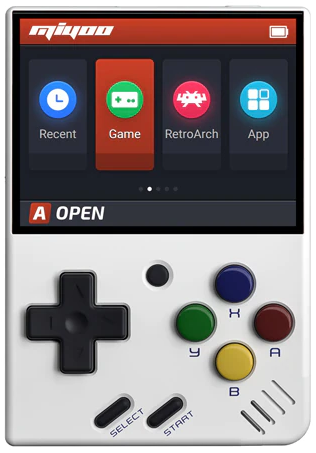
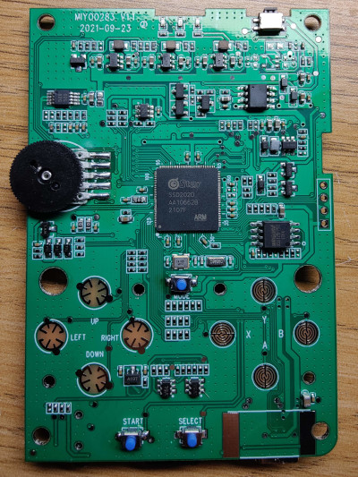
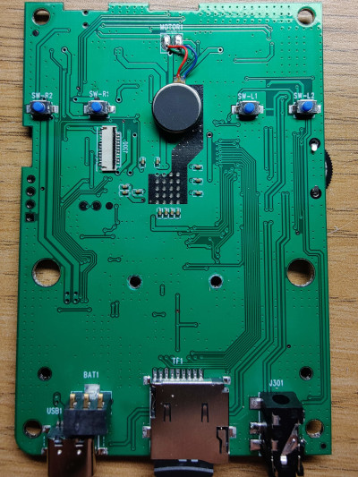

# Miyoo Mini

## Specs

- SigmaStar SSD202D
- 640x480 MIPI LCD panel (LMS279CC01)
- SPI NOR flash?
- Vibration motor?
- waa2890 or equivalent audio amp
- TP4056 lipo charger clone? (chip marked 4051)
- PT4103 backlight driver - http://www.micro-bridge.com/data/CRpowtech/PT4103E.pdf
- ALPU-FA(?) security chip

## PCB photos

## Notes

- Charger detect is gpio-59

## Discussion threads

- https://github.com/linux-chenxing/linux-chenxing.org/discussions/41#discussioncomment-1824211

## Youtube Videos

- https://www.youtube.com/watch?v=lIYXE1-OPDI&ab_channel=AlwaysBeFun
- https://www.youtube.com/watch?v=SNcezdyFg1Y&t=1s&ab_channel=AlwaysBeFun
- https://www.youtube.com/watch?v=d7GXZ2wpA9U&ab_channel=TakiUdon

## Other wikis

- [Miyoo CFW Miyoo mini page](https://github.com/TriForceX/MiyooCFW/wiki/Miyoo-Mini)

## Where to buy

[Aliexpress](https://www.aliexpress.com/item/1005003611677275.html?spm=a2g0s.9042311.0.0.56e34c4dk9u5y1)

## display re notes

- pixel sc clock source is undocumented, 0x38
- original bootcmd `bootcmd=gpio output 85 1; bootlogo 0 0 0 0 0; gpio output 4 1; mw 1f001cc0 11; gpio out 8 0; sf probe 0;sf read 0x22000000 ${sf_kernel_start} ${sf_kernel_size}; gpio out 8 1; bootm 0x22000000`
