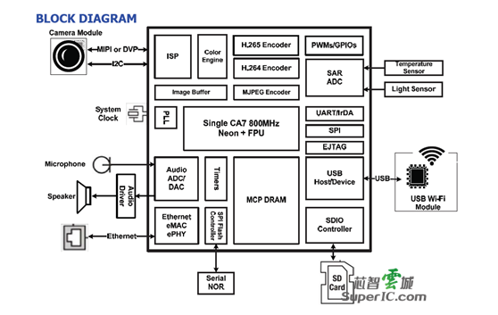
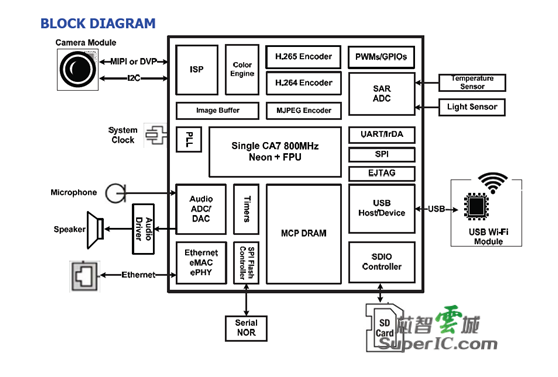

# Infinity 3

The infinity 3 family are seemingly focused towards IP camera applications.

## Specs

- 800MHz(1GHz OC) Cortex A7
- 16KB Boot ROM

## IP blocks

- Ethernet; Cadence based EMAC

- ipl; checked by ipl

- 0x18/0x1c - "sidd", seems to be some sort of current measurement that is used to control whether the core voltage can be scaled.
- 0x20


## Vendor Code

- [u-boot](https://github.com/fifteenhex/uboot_msc313e)
- [kernel](https://github.com/fifteenhex/linux_msc313e)

## Chips

### MSC313E

- chipid : 0xc2

#### Boot ROM Tag
```
MVX1##I3g4f6d5e0CMN_ROM######XVM
```

#### Block Diagram



#### Documentation

- [Data-brief](msc313e_pb_v03.pdf)

#### Known devices

##### Breadbee
- BreadBee. [github](https://github.com/breadbee/breadbee)

##### Xiaomi Cameras

- Mijia 360 1080p (MJSXJ02CM)

##### Misc 

- AM200C2 IP board camera module. [vendor page](https://www.xonz-cctv.com/product/hisilicon-solution-hc130a/)
- AM200J2 IP board camera module. [vendor page](https://www.xonz-cctv.com/product/ti-solution-ip82/)
- AM200E3 IP board camera module. [vendor page](https://www.xonz-cctv.com/product/mstar-solution-mc200e/)

### MSC316DC(DM?)

- chipid : 0xc2 (same as the msc313e, detecting what DDR config to use in u-boot is going to be annoying :()

#### Block Diagram



#### Documentation

- [Data-brief](msc316dc_pb_v03.pdf)
- [Pinout](pinouts.md#88-pin-qfn)

#### Known devices

##### Misc 

- AM400L IP board camera module. [vendor page](https://www.xonz-cctv.com/product/hisilicon-2-0mp-ip-camera-main-board-module-hc200e/)
- AM400L2 IP board camera module. [vendor page](https://www.xonz-cctv.com/product/hisilicon-1-3mp-ip-main-board-module-hc130e/)
- AM500L IP board camera module. [vendor page](https://www.xonz-cctv.com/product/mstar-solution-mt200c/)
