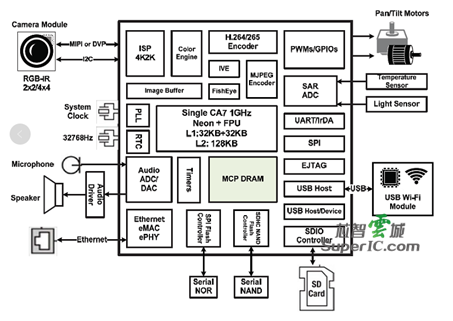

# infinity 5

This seems to be an updated version of the infinity3 IP camera SoCs.
The vendor kernel for these seems to be 4.9.84.

## SSC328Q

### Known Devices

- MC800L IP board camera module. [vendor page](https://www.xonz-cctv.com/product/ti-solution-ip91/)
