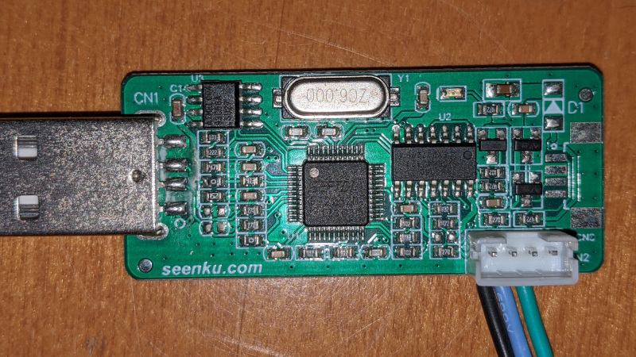

# ISP

The chips have an i2c slave behind the uart pins that seems to work even when the uart is on.

For example on a mercury5 device with the uart pins connected to the i2c controller of a board
running linux we can see two slaves on the bus:

```
$ i2cdetect -y 0
     0  1  2  3  4  5  6  7  8  9  a  b  c  d  e  f
00:          -- -- -- -- -- -- -- -- -- -- -- -- -- 
10: -- -- -- -- -- -- -- -- -- -- -- -- -- -- -- -- 
20: -- -- -- -- -- -- -- -- -- -- -- -- -- -- -- -- 
30: -- -- -- -- -- -- -- -- -- -- -- -- -- -- -- -- 
40: -- -- -- -- -- -- -- -- -- 49 -- -- -- -- -- -- 
50: -- -- -- -- -- -- -- -- -- 59 -- -- -- -- -- -- 
60: -- -- -- -- -- -- -- -- -- -- -- -- -- -- -- -- 
70: -- -- -- -- -- -- -- -- 
```

# Debug tool



- FTDI FT2232D
- NXP 74HC08D
- Atmel 93C56A

# ISP protocol

Some details on the protocol are [here](http://boeglin.org/blog/index.php?entry=Flashing-a-BenQ-Z-series-for-free%40dom%40). The same windows tool is used for all MStar chips it seems so this is probably valid across the board.

If configured correctly flashrom has a driver that can talk via i2c to the flash very slowly.
