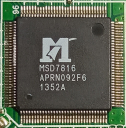

# Kronus

## Specs

- MIPS 34Kf (PRId = 0x00019555)
  - Broken FPU? (last time tested on MSD7816 (date code 1352A) running Linux 5.10.15 and Buildroot 2021.02 (or older) i.e. a long time ago)
  - 2 VPEs (i.e. you'll get 2 CPU "cores" when the `CONFIG_MIPS_MT_SMP` option is enabled)
  - 16 KiB I/D caches
  - Clock speed: 552 MHz
- 32 KiB of some OTP ROM, which might contain (MSD7816 does contain):
  - Jump to 0x94000000 (SPI flash mapping in KSEG0)
  - Some MIPS code that looks to do something with hashing, etc
  - Some hashes (presumeably for the Audio Decoder IP hash key auth)
- External 16-bit DDR2/DDR3 SDRAM, up to 128 MiB
- 1x USB 2.0 Host port
- 1x TS interface (input?)
- ...

[Pinouts](pinouts.md) | [RIU map](riu-map.md) | [Interrupt map](int-map.md)

## MSD7816

- Chip ID: 0x2f / 0x00 0x00 0x06
- eLQFP128 package; [Pinout](pinouts.md#msd7816)

### Boards

- [KLF7816_T2_02](klf7816_t2_02/index.md)
- KLF7816_T2_03

## MSD7818

- Chip ID: 0x2f? / ?? ?? ??
- eLQFP128 package; [Pinout](pinouts.md#msd7818)
