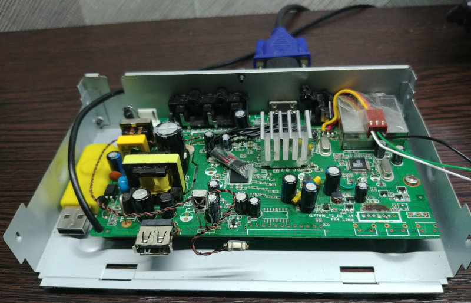
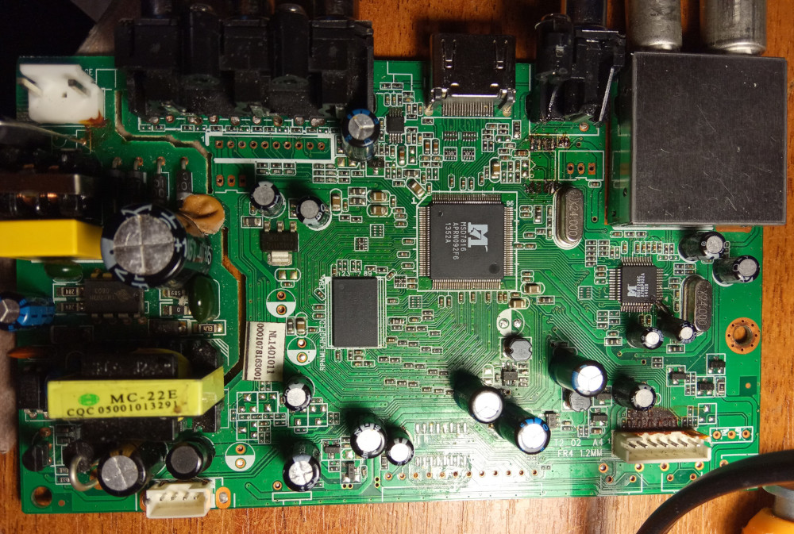

# KLF7816_T2_02

Just a random board from a random DVB-T2 set top box.

----

[Schematic](https://static.wikia.nocookie.net/mstar/images/e/ee/KLF7816_T2_03_schematic.pdf)
for a slightly different version of it (seems to be called "KLF7816_T2_03").

## Specs

- SoC: [MStar MSD7816](/kronus/index.md#msd7816)
- Demodulator: [MStar MSB1236C](/misc/msb123xc.md)
- Tuner: NM120AA
- 64 MiB 16-bit DDR2 @ 1066 MHz
- 4 MiB SPI Flash

- Onboard front panel option:
  - TM1650 for the 7-segment display and 3 buttons
  - IR receiver
  - Power LED
  - Onboard USB port

## IO pad usage

| Pin |     Pad     |   Usage                              |
|-----|-------------|--------------------------------------|
|  66 | TS1_CLK     | Demod TS Clock                       |
|  67 | TS1_D7      | Demod TS Data7                       |
|  68 | TS1_D6      | Demod TS Data6                       |
|  69 | TS1_D5      | Demod TS Data5                       |
|  70 | TS1_D4      | Demod TS Data4 / SCART aspect ratio  |
|  71 | TS1_D3      | Demod TS Data3                       |
|  72 | TS1_D2      | Demod TS Data2                       |
|  73 | TS1_D1      | Demod TS Data1                       |
|  74 | TS1_D0      | Demod TS Data0                       |
|  75 | TS1_VLD     | Demod TS Valid                       |
|  76 | TS1_SYNC    | Demod TS Sync                        |
|  79 | S_GPIO3     | SCART switch                         |
|  80 | S_GPIO4     | SCART RGB/CVBS switch                |
|  81 | I2CM0_SDA   | Frontend SDA                         |
|  82 | I2CM0_SCL   | Frontend SCL                         |
|  86 | EJ_TMS/GPIO | Audio output buffer enable           |
|  87 | EJ_TDO/GPIO | Antenna power status/overload        |
|  88 | SAR0        | Front panel Strobe                   |
|  89 | SAR1        | Front panel Data                     |
|  90 | SAR2        | Front panel Clock                    |
|  91 | SAR3        | Antenna power control                |
|  96 | GPIO_PM9    | Frontend reset                       |
| 102 | GPIO_PM4    | System power control                 |

**Note:**

- Frontend means demod+tuner part.

## Connectors

### UART

|  # | Label |        Signal       |
|----|-------|---------------------|
|  1 | GND   | Ground              |
|  2 | RX    | UART RX (+ ISP SCL) |
|  3 | TX    | UART TX (+ ISP SDA) |

[Learn about ISP there...](/isp/index.md)

### Audio

|  # | Label |    Signal    |
|----|-------|--------------|
|  1 | L     | Audio Left   |
|  2 | GND   | Ground       |
|  3 | R     | Audio Right  |

### SCART breakout

|  # | Label  |   Signal          |
|----|--------|-------------------|
|  1 | S_R    | Audio Right       |
|  2 | S_L    | Audio Left        |
|  3 | GND    | Ground            |
|  4 | S_Pb   | RGB Blue          |
|  5 | S_G    | RGB Green         |
|  6 | S_Pr   | RGB Red           |
|  7 | CVBS   | CVBS              |
|  8 | GND    | Ground            |
|  9 | RGB    | SCART Fast switch |
| 10 | ACPECT | SCART Slow switch |

### Front panel

|  # | Label |    Signal   |
|----|-------|-------------|
|  1 | DAT   | Data        |
|  2 | CLK   | Clock       |
|  3 | STB   | Strobe      |
|  4 | GND   | Ground      |
|  5 | IR    | IR receiver |
|  6 | +5V   | 5V power    |
|  7 | LED   | CEC LED     |

### USB

|  # | Label |  Signal  |
|----|-------|----------|
|  1 | +5V   | +5V VBUS |
|  2 | DM    | USB D-   |
|  3 | DP    | USB D+   |
|  4 | GND   | Ground   |
