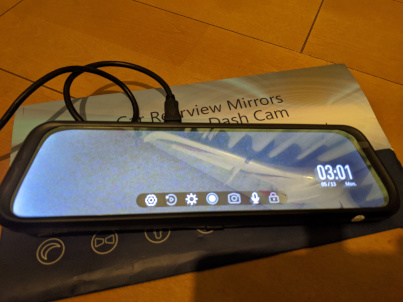
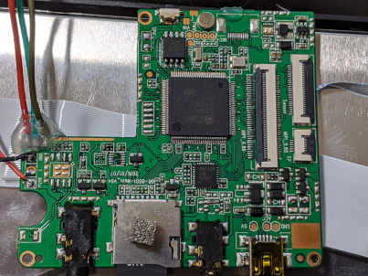
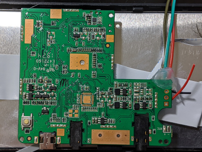

# Cheapie mirror dashcam

## Guts

## Components

- Probably [GT911](https://www.distec.de/fileadmin/pdf/produkte/Touchcontroller/DDGroup/GT911_Datasheet.pdf) touch screen controller.
- RN6752M - CVBS to MIPI CSI bridge? [some info](https://blog.csdn.net/wode1212008/article/details/75221699)

## Where to buy

- [ebay](https://www.ebay.com/itm/9-66-Inch-2-5D-Mirror-Dash-Cam-Backup-Camera-For-Cars-Streaming-Media-Dual-I4D7/264489118570?ssPageName=STRK%3AMEBIDX%3AIT&_trksid=p2060353.m2749.l2649)
