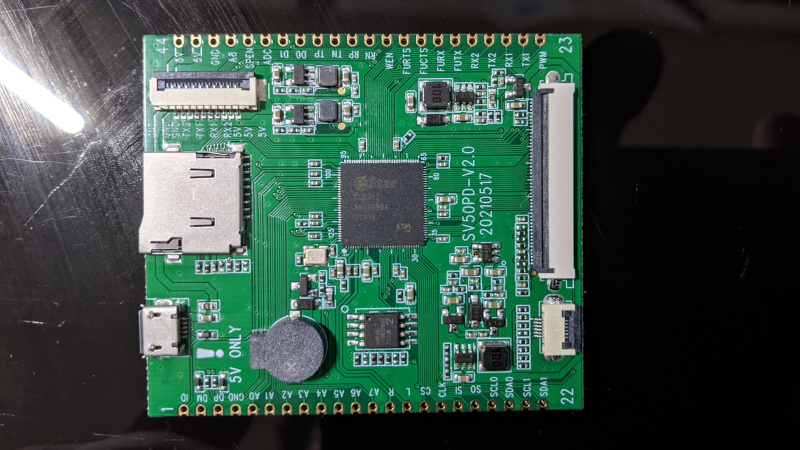
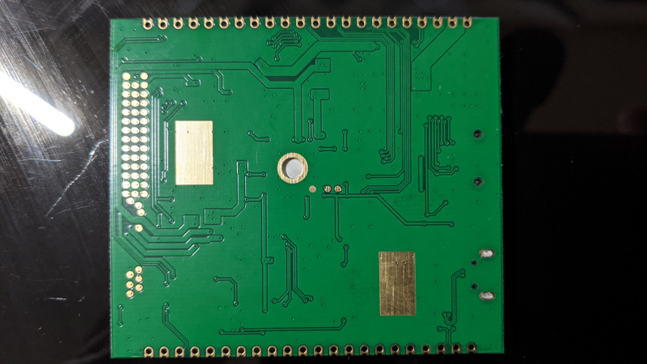

# sv50pd





## Specs

- SSD212 (Cortex A7 * 2 ~1GHz, 64MB DDR2)
- zbit [ZB25VQ128](ZB25VQ128.pdf) 128MBit SPI NOR
- PWM beeper
- SD card slot
- RGB panel/i2c touch screen interface

## Notes

- pm uart is on the test pads on the back of the board under where the SoC is on the component side.
- [taobao item](https://item.taobao.com/item.htm?id=651889719610&ali_trackid=2:mm_117358474_33384934_118778578&spm=1101.1101.N.N.31f7266)
- [vendor hardware info page](https://superv.flythings.cn/z21_sv50pd)
- LCD connects with the connects up, stiffener down.
## Pinout

| #  | board name | chip name      | #  | board name | chip name |
|----|------------|----------------|----|------------|-----------|
| 1  | id         | sd_gpio1       | 44 | 5v         |           |
| 2  | dm         |                | 43 | 5v         |           |
| 3  | dp         |                | 42 | gnd        |           |
| 4  | gnd        |                | 41 | a8         | gpio8     |
| 5  | a0         | gpio0          | 40 | spen       | key_gpio2 |
| 6  | a1         | gpio1          | 39 | adc        | sar_gpio0 |
| 7  | a2         | gpio2          | 38 | d1         | eth_led1  |
| 8  | a3         | gpio3          | 37 | d0         | eth_led0  |
| 9  | a4         | gpio4          | 36 | tp         | eth_tp    |
| 10 | a5         | gpio5          | 35 | tn         | eth_tn    |
| 11 | a6         | gpio6          | 34 | rp         | eth_rp    |
| 12 | a7         | gpio7          | 33 | rn         | eth_rn    |
| 13 | r          | aud_lineout_r0 | 32 | wen        | sd_gpio0  |
| 14 | l          | aud_lineout_l0 | 31 | furts      |           |
| 15 | cs         | sr_gpio00      | 30 | fucts      |           |
| 16 | clk        | sr_gpio01      | 29 | furx       |           |
| 17 | si         | sr_gpio02      | 28 | futx       |           |
| 18 | so         | sr_gpio03      | 27 | rx2        |           |
| 19 | scl0       | sr_gpio04      | 26 | tx2        |           |
| 20 | sda0       | sr_gpio05      | 25 | rx1        |           |
| 21 | scl1       | sr_gpio06      | 24 | tx1        |           |
| 22 | sda1       | sr_gpio07      | 23 | pwm        | key_gpio3 |

## Vendor firmware kernel log

```
127|zkswe@flythings:/ # cat /proc/kmsg                                         
<6>[    0.000000] Booting Linux on physical CPU 0x0
<5>[    0.000000] Linux version 4.9.84 (jf@jf) (gcc version 9.1.0 (OpenWrt GCC 9.1.0 1612336227) ) #376 SMP PREEMPT Tue Jul 13 05:49:59 UTC 2021
<6>[    0.000000] CPU: ARMv7 Processor [410fc075] revision 5 (ARMv7), cr=50c5387d
<6>[    0.000000] CPU: div instructions available: patching division code
<6>[    0.000000] CPU: PIPT / VIPT nonaliasing data cache, VIPT aliasing instruction cache
<3>[    0.000000] early_atags_to_fdt() success
<6>[    0.000000] OF: fdt:Machine model: PIONEER3 SSC020A-S01A-S
<7>[    0.000000] cma: early_cma(2M)
<3>[    0.000000] [ERR] LX_MEM, LX_MEM2, LX_MEM3 not 1MB aligned
<3>[    0.000000] LXmem is 0x3fe0000 PHYS_OFFSET is 0x20000000
<3>[    0.000000] Add mem start 0x20000000 size 0x3fe0000!!!!
<3>[    0.000000] 
<3>[    0.000000] LX_MEM  = 0x20000000, 0x3fe0000
<3>[    0.000000] LX_MEM2 = 0x0, 0x0
<3>[    0.000000] LX_MEM3 = 0x0, 0x0
<3>[    0.000000] EMAC_LEN= 0x0
<3>[    0.000000] DRAM_LEN= 0x0
<3>[    0.000000] deal_with_reserved_mmap memblock_reserve success mmap_reserved_config[0].reserved_start=
<3>[    0.000000] 0x23300000
<3>[    0.000000] 
<3>[    0.000000] deal_with_reserve_mma_heap memblock_reserve success mma_config[0].reserved_start=
<3>[    0.000000] 0x22300000
<3>[    0.000000] 
<7>[    0.000000] cma: dma_contiguous_reserve(limit ffffffff)
<7>[    0.000000] cma: dma_contiguous_reserve: reserving 2 MiB for global area
<7>[    0.000000] cma: cma_declare_contiguous(size 0x00200000, base 0x00000000, limit 0xffffffff alignment 0x00000000)
<6>[    0.000000] cma: Reserved 2 MiB at 0x23c00000
<6>[    0.000000] Memory policy: Data cache writealloc
<7>[    0.000000] On node 0 totalpages: 16352
<7>[    0.000000] free_area_init_node: node 0, pgdat c037aa40, node_mem_map c3f57000
<7>[    0.000000]   Normal zone: 128 pages used for memmap
<7>[    0.000000]   Normal zone: 0 pages reserved
<7>[    0.000000]   Normal zone: 16352 pages, LIFO batch:3
<6>[    0.000000] percpu: Embedded 14 pages/cpu @c3f1b000 s25048 r8192 d24104 u57344
<7>[    0.000000] pcpu-alloc: s25048 r8192 d24104 u57344 alloc=14*4096
<7>[    0.000000] pcpu-alloc: [0] 0 [0] 1 
<6>[    0.000000] Built 1 zonelists in Zone order, mobility grouping on.  Total pages: 16224
<5>[    0.000000] Kernel command line: console=ttyS0,115200 root=/dev/mtdblock2 rootfstype=squashfs ro init=/sbin/init LX_MEM=0x3FE0000 mma_heap=mma_heap_name0,miu=0,sz 
<6>[    0.000000] PID hash table entries: 256 (order: -2, 1024 bytes)
<6>[    0.000000] Dentry cache hash table entries: 8192 (order: 3, 32768 bytes)
<6>[    0.000000] Inode-cache hash table entries: 4096 (order: 2, 16384 bytes)
<6>[    0.000000] Memory: 39364K/65408K available (2170K kernel code, 205K rwdata, 864K rodata, 164K init, 149K bss, 23996K reserved, 2048K cma-reserved)
<5>[    0.000000] Virtual kernel memory layout:
<5>[    0.000000]     vector  : 0xffff0000 - 0xffff1000   (   4 kB)
<5>[    0.000000]     fixmap  : 0xffc00000 - 0xfff00000   (3072 kB)
<5>[    0.000000]     vmalloc : 0xc4000000 - 0xff800000   ( 952 MB)
<5>[    0.000000]     lowmem  : 0xc0000000 - 0xc3fe0000   (  63 MB)
<5>[    0.000000]     modules : 0xbf800000 - 0xc0000000   (   8 MB)
<5>[    0.000000]       .text : 0xc0008000 - 0xc0226d04   (2172 kB)
<5>[    0.000000]       .init : 0xc031f000 - 0xc0348000   ( 164 kB)
<5>[    0.000000]       .data : 0xc0348000 - 0xc037b5c0   ( 206 kB)
<5>[    0.000000]        .bss : 0xc037d000 - 0xc03a2618   ( 150 kB)
<6>[    0.000000] SLUB: HWalign=64, Order=0-3, MinObjects=0, CPUs=2, Nodes=1
<6>[    0.000000] Preemptible hierarchical RCU implementation.
<6>[    0.000000]       Build-time adjustment of leaf fanout to 32.
<6>[    0.000000]       RCU restricting CPUs from NR_CPUS=4 to nr_cpu_ids=2.
<6>[    0.000000] RCU: Adjusting geometry for rcu_fanout_leaf=32, nr_cpu_ids=2
<6>[    0.000000] NR_IRQS:16 nr_irqs:16 16
<3>[    0.000000] ms_init_main_intc: np->name=ms_main_intc, parent=gic
<3>[    0.000000] ms_init_pm_intc: np->name=ms_pm_intc, parent=ms_main_intc
<3>[    0.000000] ss_init_gpi_intc: np->name=ms_gpi_intc, parent=ms_main_intc
<3>[    0.000000] Find CLK_cpupll_clk, hook ms_cpuclk_ops
<6>[    0.000000] arm_arch_timer: Architected cp15 timer(s) running at 6.00MHz (virt).
<6>[    0.000000] clocksource: arch_sys_counter: mask: 0xffffffffffffff max_cycles: 0x1623fa770, max_idle_ns: 440795202238 ns
<6>[    0.000006] sched_clock: 56 bits at 6MHz, resolution 166ns, wraps every 4398046511055ns
<6>[    0.000018] Switching to timer-based delay loop, resolution 166ns
<6>[    0.000407] console [ttyS0] enabled
<6>[    0.000423] Calibrating delay loop (skipped), value calculated using timer frequency.. 12.00 BogoMIPS (lpj=60000)
<6>[    0.000438] pid_max: default: 4096 minimum: 301
<6>[    0.000558] Mount-cache hash table entries: 1024 (order: 0, 4096 bytes)
<6>[    0.000569] Mountpoint-cache hash table entries: 1024 (order: 0, 4096 bytes)
<6>[    0.001220] CPU: Testing write buffer coherency: ok
<6>[    0.001518] CPU0: update cpu_capacity 1024
<6>[    0.001527] CPU0: thread -1, cpu 0, socket 0, mpidr 80000000
<6>[    0.001640] Setting up static identity map for 0x20008240 - 0x2000828c
<6>[    0.009827] CPU1: update cpu_capacity 1024
<6>[    0.009835] CPU1: thread -1, cpu 1, socket 0, mpidr 80000001
<6>[    0.010014] Brought up 2 CPUs
<6>[    0.010024] SMP: Total of 2 processors activated (24.00 BogoMIPS).
<6>[    0.010029] CPU: All CPU(s) started in SVC mode.
<6>[    0.010798] devtmpfs: initialized
<6>[    0.029765] VFP support v0.3: implementor 41 architecture 2 part 30 variant 7 rev 5
<6>[    0.030519] clocksource: jiffies: mask: 0xffffffff max_cycles: 0xffffffff, max_idle_ns: 19112604462750000 ns
<6>[    0.030537] futex hash table entries: 16 (order: -2, 1024 bytes)
<6>[    0.031400] NET: Registered protocol family 16
<7>[    0.031609] cma: cma_alloc(cma c038c970, count 64, align 4)
<7>[    0.031968] cma: cma_alloc(): returned c3fcf000
<6>[    0.032137] DMA: preallocated 256 KiB pool for atomic coherent allocations
<6>[    0.034726] 
<6>[    0.034726] 
<6>[    0.034726] Version : MVX4##P3##g2b61bc4KL_LX409##[BR:master]#XVM
<6>[    0.034726] 
<4>[    0.046990] GPIO: probe end
<5>[    0.075247] SCSI subsystem initialized
<6>[    0.075630] usbcore: registered new interface driver usbfs
<6>[    0.075828] usbcore: registered new interface driver hub
<6>[    0.076026] usbcore: registered new device driver usb
<7>[    0.078268] cma: cma_alloc(cma c038c970, count 1, align 0)
<7>[    0.078361] cma: cma_alloc(): returned c3fcf800
<3>[    0.078379] Pinreg:0 bit:0 enable:0 speed:5
<3>[    0.078552] Port:0 Index=4
<3>[    0.078557] Enable=1
<3>[    0.078561] DmaReadMode:0
<3>[    0.078565] Speed:5
<3>[    0.078569] DmaEnable:0
<3>[    0.078572] DmaAddrMode:0
<3>[    0.078576] DmaMiuCh:0
<3>[    0.078580] DmaMiuPri:0
<3>[    0.078584] DmaPhyAddr:23c40000
<3>[    0.078657] START default delay 5(us)
<3>[    0.078663] STOP default delay 5(us)
<3>[    0.078667] HWI2C_MUTEX_CREATE!
<3>[    0.078671] HWI2C(0): initialized
<7>[    0.079766] cma: cma_alloc(cma c038c970, count 1, align 0)
<7>[    0.079811] cma: cma_alloc(): returned c3fcf820
<3>[    0.079829] Pinreg:0 bit:0 enable:0 speed:5
<3>[    0.080071] Port:1 Index=19
<3>[    0.080078] Enable=1
<3>[    0.080082] DmaReadMode:0
<3>[    0.080086] Speed:5
<3>[    0.080090] DmaEnable:1
<3>[    0.080093] DmaAddrMode:0
<3>[    0.080097] DmaMiuCh:0
<3>[    0.080101] DmaMiuPri:0
<3>[    0.080105] DmaPhyAddr:23c41000
<3>[    0.080203] START default delay 5(us)
<3>[    0.080209] STOP default delay 5(us)
<3>[    0.080213] HWI2C_MUTEX_CREATE!
<3>[    0.080217] HWI2C(1): initialized
<3>[    0.081405] [DrvPWMDutyQE0 L1063] grp:0 x0(0)
<3>[    0.081417] [DrvPWMDutyQE0 L1063] grp:0 x0(0)
<3>[    0.081425] [DrvPWMDutyQE0 L1063] grp:0 x0(0)
<3>[    0.081433] [DrvPWMDutyQE0 L1063] grp:0 x0(0)
<5>[    0.081814] [NOTICE]pwm-isr(52) success. If not i6e or i6b0, pls confirm it on .dtsi
<6>[    0.083644] clocksource: Switched to clocksource arch_sys_counter
<6>[    0.086977] NET: Registered protocol family 2
<6>[    0.087678] TCP established hash table entries: 1024 (order: 0, 4096 bytes)
<6>[    0.087704] TCP bind hash table entries: 1024 (order: 2, 20480 bytes)
<6>[    0.087738] TCP: Hash tables configured (established 1024 bind 1024)
<6>[    0.087796] UDP hash table entries: 128 (order: 0, 6144 bytes)
<6>[    0.087815] UDP-Lite hash table entries: 128 (order: 0, 6144 bytes)
<6>[    0.088011] NET: Registered protocol family 1
<6>[    0.090826] workingset: timestamp_bits=30 max_order=14 bucket_order=0
<6>[    0.103374] squashfs: version 4.0 (2009/01/31) Phillip Lougher
<6>[    0.103979] jffs2: version 2.2. © 2001-2006 Red Hat, Inc.
<6>[    0.104724] fuse init (API version 7.26)
<6>[    0.109932] io scheduler noop registered
<6>[    0.109941] io scheduler deadline registered (default)
<6>[    0.114430] usbcore: registered new interface driver usb-storage
<6>[    0.114602] usbcore: registered new interface driver ums-alauda
<6>[    0.114761] usbcore: registered new interface driver ums-datafab
<6>[    0.114909] usbcore: registered new interface driver ums-freecom
<6>[    0.115061] usbcore: registered new interface driver ums-isd200
<6>[    0.115209] usbcore: registered new interface driver ums-jumpshot
<6>[    0.115356] usbcore: registered new interface driver ums-karma
<6>[    0.115508] usbcore: registered new interface driver ums-onetouch
<6>[    0.115689] usbcore: registered new interface driver ums-realtek
<6>[    0.115843] usbcore: registered new interface driver ums-sddr09
<6>[    0.116020] usbcore: registered new interface driver ums-sddr55
<6>[    0.116175] usbcore: registered new interface driver ums-usbat
<3>[    0.150902] ERROR: Bus[0] in ms_i2c_xfer_write: Slave dev NAK, Addr: 0xa2, Data: 0xe 0x3  
<3>[    0.150927] rtc-pcf8563 0-0051: pcf8563_write_block_data: err=-110 addr=0e, data=03
<3>[    0.150936] rtc-pcf8563 0-0051: pcf8563_probe: write error
<4>[    0.151001] rtc-pcf8563: probe of 0-0051 failed with error -5
<6>[    0.151196] i2c /dev entries driver
<6>[    0.153367] 1f221000.uart0: ttyS0 at MMIO 0x0 (irq = 33, base_baud = 10800000) is a unknown
<6>[    0.154189] 1f221200.uart1: ttyS1 at MMIO 0x0 (irq = 34, base_baud = 10800000) is a unknown
<7>[    0.154940] cma: cma_alloc(cma c038c970, count 1, align 0)
<7>[    0.154992] cma: cma_alloc(): returned c3fcf840
<7>[    0.155010] cma: cma_alloc(cma c038c970, count 1, align 0)
<7>[    0.155034] cma: cma_alloc(): returned c3fcf860
<6>[    0.155162] 1f220400.uart2: ttyS3 at MMIO 0x0 (irq = 36, base_baud = 10800000) is a unknown
<6>[    0.155843] 1f221400.uart2: ttyS2 at MMIO 0x0 (irq = 37, base_baud = 10800000) is a unknown
<6>[    0.156794] >> [sdmmc] ms_sdmmc_probe 
<7>[    0.157039] cma: cma_alloc(cma c038c970, count 1, align 0)
<7>[    0.157090] cma: cma_alloc(): returned c3fcf880
<6>[    0.158850] >> [sdmmc_0] Probe Platform Devices
<3>[    0.162094] [FLASH] Load SNI from 0x6000 @ 0xc39ffc00
<3>[    0.162105] [FLASH] status2 = 0xa
<3>[    0.162119] [FLASH] status1 = 0x0
<3>[    0.162131] [SPINOR] ReadData(0x6b),Dummy(0x8),pageProgram(0x2)
<3>[    0.162134] [FLASH] BDMA mode
<3>[    0.162142] [FLASH] complement = 0x0!
<3>[    0.162148] [FLASH] top/buttom = 0x0!
<3>[    0.162156] [FLASH] blocks = 0x0!
<3>[    0.162163] [FLASH] SRP0 = 0x0!
<3>[    0.162169] [FLASH] SRP1 = 0x0!
<3>[    0.162173] [FLASH] End flash init.
<3>[    0.162179] MSYS: DMEM request: [BDMA]:0x00010000
<7>[    0.162194] cma: cma_alloc(cma c038c970, count 16, align 4)
<7>[    0.162242] cma: cma_alloc(): returned c3fcfa00
<3>[    0.162297] MSYS: DMEM request: [BDMA]:0x00010000 success, CPU phy:@0x23C50000, virt:@0xC3C50000
<7>[    0.162347] mtd .name = nor0, .size = 0x01000000 (16MiB)
<7>[    0.162347]  .erasesize = 0x00010000 .numeraseregions = 0
<5>[    0.162374] 8 cmdlinepart partitions found on MTD device nor0
<5>[    0.162380] Creating 8 MTD partitions on "nor0":
<5>[    0.162390] 0x000000000000-0x000000050000 : "BOOT0"
<5>[    0.164541] 0x000000050000-0x000000240000 : "KERNEL"
<5>[    0.166549] 0x000000240000-0x000000540000 : "rootfs"
<5>[    0.168599] 0x000000540000-0x000000d40000 : "res"
<5>[    0.170671] 0x000000d40000-0x000000ec0000 : "config"
<5>[    0.172768] 0x000000ec0000-0x000000f00000 : "internal"
<5>[    0.174948] 0x000000f00000-0x000000f80000 : "MISC"
<5>[    0.177011] 0x000000f80000-0x000001000000 : "data"
<6>[    0.179755] [ms_cpufreq_init] Current clk=799999872
<3>[    0.180431] [MSPI] mspi 0 use normal mode
<3>[    0.183545] <USB>[GADGET] PULL_UP(OFF)
<6>[    0.183707] <USB>[DRV] soc:Sstar-udc irq --> 53
<3>[    0.184153] <USB>[miu] [70] [ef] [ef] [ef].
<6>[    0.197193] <USB>[DRV] complete porbe
<6>[    0.198132] NET: Registered protocol family 17
<6>[    0.198316] [mstar_pm_init] resume_pbase=0x20011175, suspend_imi_vbase=0xC4053000
<6>[    0.198801] ThumbEE CPU extension supported.
<5>[    0.198818] Registering SWP/SWPB emulation handler
<6>[    0.200943] zkswe_usb gadget: zkswe_usb ready
<3>[    0.206960] <USB>[miu] [70] [ef] [ef] [ef].
<7>[    0.219969] <USB>[GADGET] Init USB controller
<3>[    0.220977] <USB>[GADGET] UDC start
<3>[    0.220983] <USB>[GADGET] PULL_UP(ON)
<6>[    0.221117] hctosys: unable to open rtc device (rtc0)
<3>[    0.221941] zkswe_init ok!
<3>[    0.222025] OF: /soc/i2c0@0/goodix_gt911@5D: arguments longer than property
<3>[    0.222232] [ss_gpi_intc_domain_alloc] hw:43 -> v:56
<3>[    0.222247] Goodix-TS 0-005d: goodix_irq_num:56
<6>[    0.224928] VFS: Mounted root (squashfs filesystem) readonly on device 31:2.
<6>[    0.225638] devtmpfs: mounted
<4>[    0.225667] This architecture does not have kernel memory protection.
<3>[    0.375513] ERROR: Bus[0] in ms_i2c_xfer_write: Slave dev NAK, Addr: 0xba, Data: 0x80 0x47  
<3>[    0.375535] Goodix-TS 0-005d: i2c test failed attempt 1: -110
<3>[    0.445365] ERROR: Bus[0] in ms_i2c_xfer_write: Slave dev NAK, Addr: 0xba, Data: 0x80 0x47  
<3>[    0.445386] Goodix-TS 0-005d: i2c test failed attempt 2: -110
<3>[    0.483731] Goodix-TS 0-005d: I2C communication failure: -110
<3>[    0.483741] Goodix-TS 0-005d: touchscreen config failed!!!
<11>[    0.607457] init: could not import file '/init.sstarsoc(flatteneddevicetree).rc' from '/etc/init.rc'
<6>[    0.621504] <USB>[LINK] Bus reset.
<6>[    0.621511] <USB>[LINK] High speed device
<6>[    0.697660] android_work: sent uevent USB_STATE=CONNECTED
<3>[    0.717418] android_usb: already disabled
<6>[    0.752363] <USB>[LINK] Bus reset.
<6>[    0.752396] <USB>[LINK] High speed device
<6>[    0.752502] android_work: sent uevent USB_STATE=DISCONNECTED
<6>[    0.845625] android_work: sent uevent USB_STATE=CONNECTED
<6>[    0.848823] <USB>[LINK] Suspend
<6>[    0.854649] adb_open
<6>[    0.854659] adb_bind_config
<6>[    0.897662] <USB>[LINK] Bus reset.
<6>[    0.897692] <USB>[LINK] High speed device
<6>[    0.897792] android_work: sent uevent USB_STATE=DISCONNECTED
<6>[    0.973734] android_work: sent uevent USB_STATE=CONNECTED
<6>[    1.028359] <USB>[LINK] Bus reset.
<6>[    1.028383] <USB>[LINK] High speed device
<6>[    1.028479] android_work: sent uevent USB_STATE=DISCONNECTED
<6>[    1.121588] android_work: sent uevent USB_STATE=CONNECTED
<6>[    1.123547] zkswe_usb gadget: high-speed config #1: zkswe
<6>[    1.123582] <USB>[EP][1] Enable for BULK IN with maxpacket/fifo(512/8192)
<6>[    1.123592] <USB>[EP][2] Enable for BULK OUT with maxpacket/fifo(512/1024)
<6>[    1.123752] android_work: sent uevent USB_STATE=CONFIGURED
<4>[    1.156381] mhal: loading out-of-tree module taints kernel.
<4>[    1.156394] mhal: module license 'PROPRIETARY' taints kernel.
<4>[    1.156398] Disabling lock debugging due to kernel taint
<6>[    1.164757] mhal driver init
<3>[    1.167253] jpe driver probed
<3>[    1.167459] [DRV_DIVP_PROC_Init]
<38>[    1.207339] logd.auditd: start
<3>[    1.285223] module [sys] init
<3>[    1.285592] MI_SYSCFG_SetupMmapLoader default_config_path:/config/config_tool, argv1:/config/load_mmap,argv2:/config/mmap.ini
<5>[    1.309166] Function = init_glob_miu_kranges, Line = 770, Insert KProtect for LX @ MIU: 0
<5>[    1.309178] Function = init_glob_miu_kranges, Line = 779, [INIT] for LX0 kprotect: from 0x20000000 to 0x23FE0000, using block 0
<3>[    1.309550] config...... cmdpath:/config/config_tool, argv0:/config/load_config
<3>[    1.309556] config...... cmdpath:/config/config_tool, argv1:/misc/config.ini
<3>[    1.309561] config...... cmdpath:/config/config_tool, argv2:/misc/PQConfig.ini
<3>[    1.309565] config...... cmdpath:/config/config_tool, argv3:(null)
<5>[    1.326080] function:parese_Cmdline,pCmd_Section:0x3FE0000
<5>[    1.326090] m
<5>[    1.326094] m
<5>[    1.326097] a
<5>[    1.326100] _
<5>[    1.326102] h
<5>[    1.326105] e
<5>[    1.326108] a
<5>[    1.326111] p
<5>[    1.326113] _
<5>[    1.326116] n
<5>[    1.326118] a
<5>[    1.326121] m
<5>[    1.326124] e
<5>[    1.326127] 0
<5>[    1.326135]     miu=0,sz=1000000  reserved_start=22300000
<5>[    1.326548] r_front->miuBlockIndex:0,r_front->start_cpu_bus_pa:0x20000000,r_front->start_cpu_bus_pa+r_front->length:0x22300000
<5>[    1.326564] r_back->miuBlockIndex:1,r_back->start_cpu_bus_pa:0x23300000,r_back->start_cpu_bus_pa+r_back->length:0x23fe0000
<5>[    1.326576] mi_sys_mma_allocator_create success, heap_base_addr=22300000 length=1000000 
<3>[    1.326596] mi_sys_mma_allocator_create success, heap_base_addr=20000000 length=20000 
<5>[    1.328131] Sigmastar Module mi_sys version: project_commit.8179ed6 sdk_commit.74b913c build_time.20210527192810
<3>[    1.358152] module [gfx] init
<3>[    1.381249] module [rgn] init
<3>[    1.406239] module [ao] init
<3>[    1.433100] module [panel] init
<3>[    1.459240] module [disp] init
<3>[    1.482827] module [divp] init
<3>[    1.507029] module [vdisp] init
<7>[    1.539247] [FB_DEVICE]
<7>[    1.539255] FB_HWLAYER_ID=0
<7>[    1.539258] FB_HWWIN_ID=0
<7>[    1.539261] FB_HWLAYER_DST=0
<7>[    1.539265] FB_HWWIN_FORMAT=5
<7>[    1.539268] FB_HWLAYER_OUTPUTCOLOR=0
<7>[    1.539271] FB_WIDTH=1024
<7>[    1.539274] FB_HEIGHT=600
<7>[    1.539277] FB_TIMMING_WIDTH=1024
<7>[    1.539280] FB_TIMMING_HEIGHT=600
<7>[    1.539283] FB_MMAP_NAME=E_MMAP_ID_FB
<7>[    1.539287] FB_BUFFER_LEN=4800
<7>[    1.539292] 
<7>[    1.539298] Sstar frame buffer device,numFbHwlayer:1
<7>[    1.539301] 
<7>[    1.539321] 
<7>[    1.539328] fb0 parse_hwLayerInfo buffercount=2,sstar_fb_var_infos[seq].yres_virtual=1200
<7>[    1.539331] 
<7>[    1.539813] 
<7>[    1.539821] fb0: Sstar frame buffer device
<7>[    1.539824] 
<5>[    2.234426] client [692] connected, module:sys
<3>[    2.234635] GE_EnableDynaClkGate
<3>[    2.235012]  MI_Moduledev_RegisterDev  
<5>[    2.238819] client [692] connected, module:disp
<3>[    2.243389] client [692] connected, module:panel
<3>[    2.340317] [ss_gpi_intc_domain_alloc] hw:61 -> v:57
<3>[    2.341421] [ss_gpi_intc_domain_alloc] hw:62 -> v:58
<3>[    2.342500] [ss_gpi_intc_domain_alloc] hw:63 -> v:59
<3>[    2.343615] [ss_gpi_intc_domain_alloc] hw:64 -> v:60
<3>[    2.344779] [ss_gpi_intc_domain_alloc] hw:65 -> v:61
<3>[    2.345868] [ss_gpi_intc_domain_alloc] hw:66 -> v:62
<3>[    2.346961] [ss_gpi_intc_domain_alloc] hw:67 -> v:63
<3>[    2.348084] [ss_gpi_intc_domain_alloc] hw:68 -> v:64
<3>[    2.349193] [ss_gpi_intc_domain_alloc] hw:69 -> v:65
<7>[    2.380135] 
<7>[    2.380143] MI_Moduledev_RegisterDev Enter
<7>[    2.380146] 
<7>[    2.380217] 
<7>[    2.380223] gGfxDevHdl = c43f7000.
<7>[    2.380226] 
<7>[    2.380297] 
<7>[    2.380303] sstar_fb_open fb:0 info->fix.smem_start = 0x30121000,user=1
<7>[    2.380305] 
<4>[    2.380343] HalGopSetGwinSrcFmt 834, GopID:7, Fmt:4
<7>[    2.380354] [GOP]HalGopSetArgb1555Alpha 1073: GOPId=0x7 not support
<7>[    2.380359] [GOP]HalGopSetArgb1555Alpha 1073: GOPId=0x7 not support
<7>[    2.380462] 
<7>[    2.380469] screen_base:c43fc000
<7>[    2.380472] 
<3>[    2.382512] 
<3>[    2.382520] sstar_FB_SetBlending 425 u8GOP=0,u8win=0 aType=1 u8constAlpha=255
<3>[    2.382523] 
<4>[    2.382544] HalGopSetGwinSrcFmt 834, GopID:7, Fmt:5
<7>[    2.382640] 
<7>[    2.382649] sstar_fb_mmap vma->vm_start=41000000
<7>[    2.382649]  vma->vm_end=414b0000
<7>[    2.382649]  vma->vm_pgoff =50121
<7>[    2.382652] 
<3>[    2.382880] client [692] connected, module:gfx
<6>[    3.409942] Freeing fb memory: 3072K
<5>[    5.365479] random: fast init done
```
