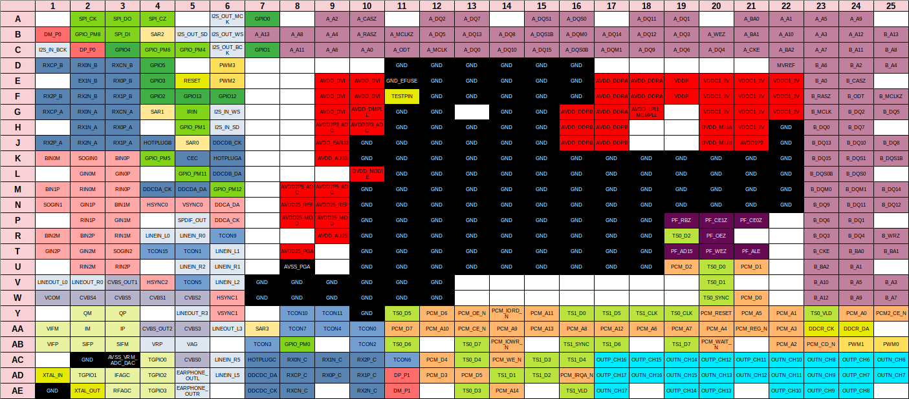

# Titania4 pinouts

## MSD309PX

- Package: 20x20mm 536-ball BGA

#### HDMI

| Ball | Name                          |
|------|-------------------------------|
| G2   | PAD_RX0N_A                    |
| H3   | PAD_RX0P_A                    |
| H2   | PAD_RX1N_A                    |
| J3   | PAD_RX1P_A                    |
| J2   | PAD_RX2N_A                    |
| J1   | PAD_RX2P_A                    |
| G3   | PAD_RXCN_A                    |
| G1   | PAD_RXCP_A                    |
| M4   | DDCDA_CK                      |
| M5   | DDCDA_DA                      |
| K6   | PAD_HOTPLUGA                  |
| D2   | PAD_RX0N_B                    |
| E3   | PAD_RX0P_B                    |
| E2   | PAD_RX1N_B                    |
| F3   | PAD_RX1P_B                    |
| F2   | PAD_RX2N_B                    |
| F1   | PAD_RX2P_B                    |
| D3   | PAD_RXCN_B                    |
| D1   | PAD_RXCP_B                    |
| J6   | DDCDB_CK                      |
| L6   | DDCDB_DA                      |
| J4   | PAD_HOTPLUGB                  |
| AC8  | PAD_RX0N_C                    |
| AD9  | PAD_RX0P_C                    |
| AC9  | PAD_RX1N_C                    |
| AD10 | PAD_RX1P_C                    |
| AE10 | PAD_RX2N_C                    |
| AC10 | PAD_RX2P_C                    |
| AE8  | PAD_RXCN_C                    |
| AD8  | PAD_RXCP_C                    |
| AE7  | DDCDC_CK                      |
| AD7  | DDCDC_DA                      |
| AC7  | PAD_HOTPLUGC                  |
| K5   | PAD_CEC                       |

#### RGB

| Ball | Name                          |
|------|-------------------------------|
| M2   | PADA_RIN0M                    |
| M3   | PADA_RIN0P                    |
| L2   | PADA_GIN0M                    |
| L3   | PADA_GIN0P                    |
| K1   | PADA_BIN0M                    |
| K3   | PADA_BIN0P                    |
| K2   | PADA_SOGIN0                   |
| N4   | PAD_HSYNC0                    |
| N5   | PAD_VSYNC0                    |
| R3   | PADA_RIN1M                    |
| P2   | PADA_RIN1P                    |
| P3   | PADA_GIN1M                    |
| N2   | PADA_GIN1P                    |
| N3   | PADA_BIN1M                    |
| M1   | PADA_BIN1P                    |
| N1   | PAD_SOGIN1                    |
| W6   | PAD_HSYNC1                    |
| Y6   | PAD_VSYNC1                    |
| U2   | PADA_RIN2M                    |
| U3   | PADA_RIN2P                    |
| T2   | PADA_GIN2M                    |
| T1   | PADA_GIN2P                    |
| R1   | PADA_BIN2M                    |
| R2   | PADA_BIN2P                    |
| T3   | PADA_SOGIN2                   |
| V4   | PAD_HSYNC2                    |

#### CVBS

| Ball | Name                          |
|------|-------------------------------|
| AC5  | PADA_CVBS0                    |
| W4   | PADA_CVBS1                    |
| W5   | PADA_CVBS2                    |
| AA5  | PADA_CVBS3                    |
| W2   | PADA_CVBS4                    |
| W3   | PADA_CVBS5                    |
| V3   | PADA_CVBS_OUT1                |
| AA4  | PADA_CVBS_OUT2                |
| W1   | PADA_VCOM                     |

#### LVDS

| Ball | Name                          |
|------|-------------------------------|
| AC24 | PADA_OUTP_CH6/PAD_R_ODD7      |
| AC25 | PADA_OUTN_CH6/PAD_R_ODD6      |
| AD24 | PADA_OUTP_CH7/PAD_R_ODD5      |
| AD25 | PADA_OUTN_CH7/PAD_R_ODD4      |
| AE24 | PADA_OUTP_CH8/PAD_R_ODD3      |
| AC23 | PADA_OUTN_CH8/PAR_R_ODD2      |
| AE23 | PADA_OUTP_CH9/PAD_R_ODD1      |
| AD23 | PADA_OUTN_CH9/PAD_R_ODD0      |
| AE22 | PADA_OUTP_CH10/PAD_G_ODD7     |
| AC22 | PADA_OUTN_CH10/PAD_G_ODD6     |
| AC21 | PADA_OUTP_CH11/PAD_G_ODD5     |
| AD22 | PADA_OUTN_CH11/PAD_G_ODD4     |
| AC20 | PADA_OUTP_CH12/PAD_G_ODD3     |
| AD21 | PADA_OUTN_CH12/PAD_G_ODD2     |
| AE20 | PADA_OUTP_CH13/PAD_G_ODD1     |
| AD20 | PADA_OUTN_CH13/PAD_G_ODD0     |
| AE19 | PADA_OUTP_CH14/PAD_B_ODD7     |
| AC19 | PADA_OUTN_CH14/PAD_B_ODD6     |
| AC18 | PADA_OUTP_CH15/PAD_B_ODD5     |
| AD19 | PADA_OUTN_CH15/PAD_B_ODD4     |
| AC17 | PADA_OUTP_CH16/PAD_B_ODD3     |
| AD18 | PADA_OUTN_CH16/PAD_B_ODD2     |
| AE17 | PADA_OUTP_CH17/PAD_B_ODD1     |
| AD17 | PADA_OUTP_CH17/PAD_B_ODD0     |

#### Audio

| Ball | Name                          |
|------|-------------------------------|
| R4   | PAD_LINEIN_L0                 |
| R5   | PAD_LINEIN_R0                 |
| T6   | PAD_LINEIN_L1                 |
| U6   | PAD_LINEIN_R1                 |
| V6   | PAD_LINEIN_L2                 |
| U5   | PAD_LINEIN_R2                 |
| AD6  | PAD_LINEIN_L5                 |
| AC6  | PAD_LINEIN_R5                 |
| V1   | PAD_LINEOUT_L0                |
| V2   | PAD_LINEOUT_R0                |
| AA6  | PAD_LINEOUT_L3                |
| Y5   | PAD_LINEOUT_R3                |
| AD5  | PAD_EARPHONE_OUTL             |
| AE5  | PAD_EARPHONE_OUTR             |
| AB4  | PAD_VRP                       |
| AB5  | PAD_VAG                       |
| AC3  | AVSS_VRM_ADC_DAC              |

#### I2S

| Ball | Name                          |
|------|-------------------------------|
| A6   | PAD_I2S_OUT_MCK               |
| B5   | PAD_I2S_OUT_SD                |
| B6   | PAD_I2S_OUT_WS                |
| C6   | PAD_I2S_OUT_BCK               |
| C1   | PAD_I2S_IN_BCK                |
| H6   | PAD_I2S_IN_SD                 |
| G6   | PAD_I2S_IN_WS                 |

#### SPDIF

| Ball | Name                          |
|------|-------------------------------|
| P5   | PAD_SPDIF_OUT                 |

#### PWM

| Ball | Name                          |
|------|-------------------------------|
| AB25 | PAD_PWM0                      |
| AB24 | PAD_PWM1                      |
| E6   | PAD_PWM2                      |
| D6   | PAD_PWM3                      |

#### SAR

| Ball | Name                          |
|------|-------------------------------|
| J5   | PAD_SAR0                      |
| G4   | PAD_SAR1                      |
| B4   | PAD_SAR2                      |
| AA7  | PAD_SAR3                      |

#### SPI

| Ball | Name                          |
|------|-------------------------------|
| C4   | PAD_GPIO_PM6                  |
| A4   | PAD_SPI_CZ                    |
| A2   | PAD_SPI_CK                    |
| B3   | PAD_SPI_DI                    |
| A3   | PAD_SPI_DO                    |
| B2   | PAD_GPIO_PM8                  |

#### I2CS/UART

| Ball | Name                          |
|------|-------------------------------|
| P6   | DDCA_CK *UART_RX*             |
| N6   | DDCA_CK *UART_TX*             |

#### I2CM

| Ball | Name                          |
|------|-------------------------------|
| A23  | PAD_DDCR_CK                   |
| A24  | PAD_DDCR_DA                   |

#### IR

| Ball | Name                          |
|------|-------------------------------|
| G5   | PAD_IRIN                      |

#### XTAL

| Ball | Name                          |
|------|-------------------------------|
| AD1  | PAD_XTAL_IN                   |
| AE2  | PAD_XTAL_OUT                  |

#### Reset

| Ball | Name                          |
|------|-------------------------------|
| E5   | PAD_RESET                     |

#### USB

| Ball | Name                          |
|------|-------------------------------|
| C2   | PAD_DP_P0                     |
| B1   | PAD_DM_P0                     |
| AD11 | PAD_DP_P1                     |
| AE11 | PAD_DM_P1                     |

#### GPIO

| Ball | Name                          |
|------|-------------------------------|
| A7   | PAD_GPIO0                     |
| C7   | PAD_GPIO1                     |
| F4   | PAD_GPIO2                     |
| E4   | PAD_GPIO3                     |
| C3   | PAD_GPIO4                     |
| D4   | PAD_GPIO5                     |
| F6   | PAD_GPIO12                    |
| F5   | PAD_GPIO13                    |

#### GPIO_PM

| Ball | Name                          |
|------|-------------------------------|
| AB8  | PAD_GPIO_PM0                  |
| H5   | PAD_GPIO_PM1                  |
| C5   | PAD_GPIO_PM4                  |
| K4   | PAD_GPIO_PM5                  |
| L5   | PAD_GPIO_PM11                 |
| M6   | PAD_GPIO_PM12                 |

#### GPIO_TCON

| Ball | Name                          |
|------|-------------------------------|
| AA10 | PAD_TCON0                     |
| T5   | PAD_TCON1                     |
| AB10 | PAD_TCON2                     |
| AB7  | PAD_TCON3                     |
| AA9  | PAD_TCON4                     |
| V5   | PAD_TCON5                     |
| AC11 | PAD_TCON6                     |
| AA8  | PAD_TCON7                     |
| R6   | PAD_TCON9                     |
| Y8   | PAD_TCON10                    |
| Y9   | PAD_TCON11                    |
| T4   | PAD_TCON15                    |

#### PCMCIA

| Ball | Name                          |
|------|-------------------------------|
| W21  | PAD_PCM_D0                    |
| U21  | PAD_PCM_D1                    |
| U19  | PAD_PCM_D2                    |
| AD12 | PAD_PCM_D3                    |
| AC12 | PAD_PCM_D4                    |
| AD13 | PAD_PCM_D5                    |
| Y12  | PAD_PCM_D6                    |
| AA11 | PAD_PCM_D7                    |
| Y24  | PAD_PCM_A0                    |
| Y22  | PAD_PCM_A1                    |
| AB22 | PAD_PCM_A2                    |
| AA22 | PAD_PCM_A3                    |
| AA20 | PAD_PCM_A4                    |
| Y21  | PAD_PCM_A5                    |
| AA18 | PAD_PCM_A6                    |
| AA19 | PAD_PCM_A7                    |
| AA16 | PAD_PCM_A8                    |
| AA14 | PAD_PCM_A9                    |
| AA12 | PAD_PCM_A10                   |
| Y15  | PAD_PCM_A11                   |
| AA17 | PAD_PCM_A12                   |
| AA15 | PAD_PCM_A13                   |
| AE14 | PAD_PCM_A14                   |
| Y20  | PAD_PCM_RESET                 |
| AD16 | PAD_PCM_IRQA_N                |
| Y13  | PAD_PCM_OE_N                  |
| Y14  | PAD_PCM_IORD_N                |
| AA13 | PAD_PCM_CE_N                  |
| AC14 | PAD_PCM_WE_N                  |
| AB23 | PAD_PCM_CD_N                  |
| AB20 | PAD_PCM_WAIT_N                |
| AB14 | PAD_PCM_IOWR_N                |
| AA21 | PAD_PCM_REG_N                 |
| Y25  | PAD_PCM2_CE_N                 |

#### NAND Flash

It's essentially useless.

| Ball | Name                          |
|------|-------------------------------|
| T21  | PAD_PF_ALE                    |
| T19  | PAD_PF_AD15                   |
| P21  | PAD_PF_CE0Z                   |
| P20  | PAD_PF_CE1Z                   |
| R20  | PAD_PF_OEZ                    |
| T20  | PAD_PF_WEZ                    |
| P19  | PAD_PF_RBZ                    |

#### TS

| Ball | Name                          |
|------|-------------------------------|
| Y16  | PAD_TS1_D0                    |
| AD14 | PAD_TS1_D1                    |
| AD15 | PAD_TS1_D2                    |
| AC15 | PAD_TS1_D3                    |
| AC16 | PAD_TS1_D4                    |
| Y17  | PAD_TS1_D5                    |
| AB17 | PAD_TS1_D6                    |
| AB19 | PAD_TS1_D7                    |
| Y18  | PAD_TS1_CLK                   |
| AE16 | PAD_TS1_VLD                   |
| AB16 | PAD_TS1_SYNC                  |
| U20  | PAD_TS0_D0                    |
| V20  | PAD_TS0_D1                    |
| R19  | PAD_TS0_D2                    |
| AE13 | PAD_TS0_D3                    |
| AC13 | PAD_TS0_D4                    |
| Y11  | PAD_TS0_D5                    |
| AB11 | PAD_TS0_D6                    |
| AB13 | PAD_TS0_D7                    |
| Y19  | PAD_TS0_CLK                   |
| Y23  | PAD_TS0_VLD                   |
| W20  | PAD_TS0_SYNC                  |

#### Frontend

| Ball | Name                          |
|------|-------------------------------|
| AA3  | PAD_IP                        |
| AA2  | PAD_IM                        |
| Y3   | PAD_QP                        |
| Y2   | PAD_QM                        |
| AB1  | PAD_VIFP                      |
| AA1  | PAD_VIFM                      |
| AB2  | PAD_SIFP                      |
| AB3  | PAD_SIFM                      |
| AD3  | PAD_IFAGC                     |
| AE3  | PAD_RFAGC                     |
| AC4  | PAD_TGPIO0                    |
| AD2  | PAD_TGPIO1                    |
| AD4  | PAD_TGPIO2                    |
| AE4  | PAD_TGPIO3                    |

#### MIU

| Ball | Name                          |
|------|-------------------------------|
| C10  | PAD_IO8/A_A0                  |
| A22  | PAD_IO41/A_A1                 |
| A9   | PAD_IO5/A_A2                  |
| B23  | PAD_IO44/A_A3                 |
| B9   | PAD_IO3/A_A4                  |
| A23  | PAD_IO43/A_A5                 |
| C9   | PAD_IO6/A_A6                  |
| C23  | PAD_IO45/A_A7                 |
| B8   | PAD_IO4/A_A8                  |
| A24  | PAD_IO46/A_A9                 |
| B22  | PAD_IO42/A_A10                |
| C8   | PAD_IO2/A_A11                 |
| B24  | PAD_IO35/A_A12                |
| B7   | PAD_IO0/A_A13                 |
| C13  | PAD_IO14/A_DQ0                |
| A19  | PAD_IO32/A_DQ1                |
| A12  | PAD_IO15/A_DQ2                |
| B19  | PAD_IO33/A_DQ3                |
| C20  | PAD_IO34/A_DQ4                |
| B12  | PAD_IO13/A_DQ5                |
| C19  | PAD_IO31/A_DQ6                |
| A13  | PAD_IO17/A_DQ7                |
| B14  | PAD_IO18/A_DQ8                |
| C18  | PAD_IO29/A_DQ9                |
| C14  | PAD_IO19/A_DQ10               |
| A18  | PAD_IO30/A_DQ11               |
| B18  | PAD_IO28/A_DQ12               |
| B13  | PAD_IO16/A_DQ13               |
| B17  | PAD_IO26/A_DQ14               |
| C15  | PAD_IO20/A_DQ15               |
| A16  | PAD_IO23/A_DQS0               |
| C16  | PAD_IO24/A_DQS0B              |
| A15  | PAD_IO21/A_DQS1               |
| B15  | PAD_IO22/A_DQS1B              |
| B16  | PAD_IO26/A_DQM0               |
| C17  | PAD_IO25/A_DQM1               |
| C12  | PAD_IO12/A_MCLK               |
| B11  | PAD_IO10/A_MCLKZ              |
| C21  | PAD_IO37/A_CKE                |
| B20  | PAD_IO36/A_WEZ                |
| B10  | PAD_IO9/A_RASZ                |
| A10  | PAD_IO7/A_CASZ                |
| A21  | PAD_IO39/A_BA0                |
| B21  | PAD_IO38/A_BA1                |
| C22  | PAD_IO40/A_BA2                |
| C11  | PAD_IO11/A_ODT                |
| E23  | PAD_IO55/B_A0                 |
| U24  | PAD_IO88/B_A1                 |
| D24  | PAD_IO52/B_A2                 |
| V25  | PAD_IO91/B_A3                 |
| D25  | PAD_IO50/B_A4                 |
| V24  | PAD_IO90/B_A5                 |
| D23  | PAD_IO53/B_A6                 |
| W25  | PAD_IO92/B_A7                 |
| C25  | PAD_IO51/B_A8                 |
| W24  | PAD_IO93/B_A9                 |
| V23  | PAD_IO89/B_A10                |
| C24  | PAD_IO49/B_A11                |
| W23  | PAD_IO82/B_A12                |
| B25  | PAD_IO47/B_A13                |
| H23  | PAD_IO61/B_DQ0                |
| P24  | PAD_IO79/B_DQ1                |
| G24  | PAD_IO62/B_DQ2                |
| R23  | PAD_IO80/B_DQ3                |
| R24  | PAD_IO81/B_DQ4                |
| G25  | PAD_IO60/B_DQ5                |
| P23  | PAD_IO78/B_DQ6                |
| H24  | PAD_IO64/B_DQ7                |
| J25  | PAD_IO65/B_DQ8                |
| N23  | PAD_IO76/B_DQ9                |
| J24  | PAD_IO66/B_DQ10               |
| N24  | PAD_IO77/B_DQ11               |
| N25  | PAD_IO75/B_DQ12               |
| J23  | PAD_IO63/B_DQ13               |
| M25  | PAD_IO74/B_DQ14               |
| K23  | PAD_IO67/B_DQ15               |
| L24  | PAD_IO70/B_DQS0               |
| L23  | PAD_IO71/B_DQS0B              |
| K24  | PAD_IO68/B_DQS1               |
| K25  | PAD_IO69/B_DQS1B              |
| M23  | PAD_IO73/B_DQM0               |
| M24  | PAD_IO72/B_DQM1               |
| G23  | PAD_IO59/B_MCLK               |
| F25  | PAD_IO57/B_MCLKZ              |
| T23  | PAD_IO84/B_CKE                |
| R25  | PAD_IO83/B_WEZ                |
| F23  | PAD_IO56/B_RASZ               |
| E24  | PAD_IO54/B_CASZ               |
| T24  | PAD_IO86/B_BA0                |
| T25  | PAD_IO85/B_BA1                |
| U23  | PAD_IO87/B_BA2                |
| F24  | PAD_IO58/B_ODT                |
| D22  | MVREF                         |

#### Misc

| Ball | Name                          |
|------|-------------------------------|
| F11  | PAD_GND_EFUSE                 |
| E11  | PAD_TESTPIN                   |

#### Power

| Ball | Name                          |
|------|-------------------------------|
| E22  | VDDC1_2V                      |
| F22  | VDDC1_2V                      |
| E21  | VDDC1_2V                      |
| F21  | VDDC1_2V                      |
| G21  | VDDC1_2V                      |
| H21  | VDDC1_2V                      |
| E20  | VDDC1_2V                      |
| F20  | VDDC1_2V                      |
| G20  | VDDC1_2V                      |
| G22  | VDDC1_2V                      |
| H20  | DVDD_MIUA                     |
| J20  | DVDD_MIUB                     |
| J21  | AVDD1P2                       |
| M8   | AVDD2P5_ADC                   |
| M9   | AVDD2P5_ADC                   |
| N8   | AVDD25_REF                    |
| N9   | AVDD25_REF                    |
| R9   | AVDD_AU25                     |
| P8   | AVDD25_MOD                    |
| P9   | AVDD25_MOD                    |
| T8   | AVDD25_PGA                    |
| U8   | AVSS_PGA                      |
| E9   | AVDD_DVI                      |
| E10  | AVDD_DVI                      |
| F9   | AVDD_DVI                      |
| F10  | AVDD_DVI                      |
| G9   | AVDD_DVI                      |
| G10  | AVDD_DMPLL                    |
| H9   | AVDD3P3_ADC                   |
| H10  | AVDD3P3_ADC                   |
| K9   | AVDD_AU33                     |
| J9   | AVDD_EAR33                    |
| E19  | VDDP                          |
| F19  | VDDP                          |
| G18  | AVDD_LPLL_MEMPLL              |
| E17  | AVDD_DDRA                     |
| E18  | AVDD_DDRA                     |
| F17  | AVDD_DDRA                     |
| F18  | AVDD_DDRA                     |
| G17  | AVDD_DDRA                     |
| G16  | AVDD_DDRB                     |
| H16  | AVDD_DDRB                     |
| H17  | AVDD_DDRB                     |
| J16  | AVDD_DDRB                     |
| J17  | AVDD_DDRB                     |
| L10  | DVDD_NODIE                    |
